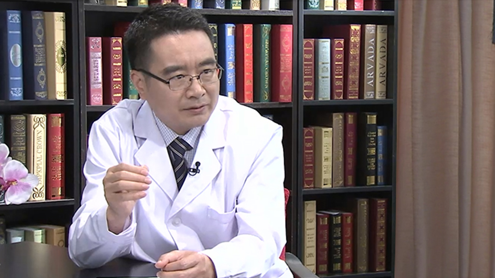

# 4.16 肺大泡

---

## 刘彦国 主任医师

北京大学人民医院胸外科主任医师 研究生副导师 北京大学人民医院病房医疗组长；

中国医师协会胸外科分会手汗症专家委员会副主任委员；中国医师协会住院医规培心胸外科专委会秘书；国家卫计委人才中心住院医规培胸心外科考核委员会委员；国家医学考试中心专家委员会委员。

**主要成就：** 2009年获中华医学科技三等奖； 2013年获国家科技进步二等奖（参与肺癌微创诊疗手术体系研究，是迄今国内肺癌领域唯一的国家奖）； 国内外核心期刊发表论文30余篇，参编各类医学专著7部。

**专业特长：** 擅长手汗症、肺癌、纵隔肿瘤、肺大泡等外科治疗，尤其是胸腔镜微创手术，居国内领先水平；2012年赴奥地利维也纳Otto Wagner医院及瑞士苏黎世大学医院做访问学者；主持手汗症相关研究，其成果是国际上多个临床指南最重要的循证医学依据。

---
