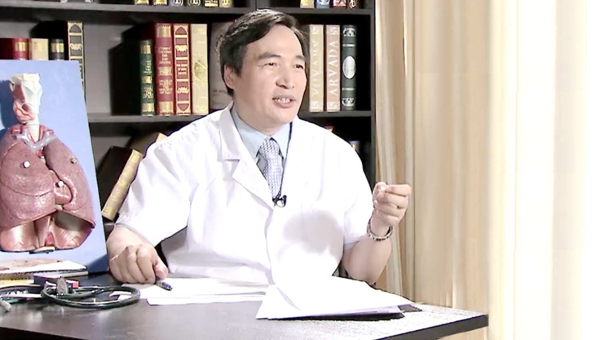

# 4.20 肺脓肿

---

## 方保民 主任医师

北京医院老年医学部呼吸与危重症科主任 呼吸科副主任 主任医师；

中华医学会老年呼吸分会委员；中华医学会呼吸病学分会肺血管病学组委员；美国德克萨斯医学健康中心访问学者。

**专业特长：** 特别擅长于呼吸危重病诊断和抢救（如各种原因引起的呼吸衰竭，急性左心衰、急性呼吸窘迫综合症（ARDS）、重症肺炎、危重症哮喘、肺血管栓塞等）及呼吸道管理技术；机械通气技术（有创和无创呼吸机调节和应用）。熟练操作支气管镜及支气管镜引导下气管内新生物（如肉芽肿和肺癌等）钬激光治疗术及组织细胞氧合监测技术等。

---
