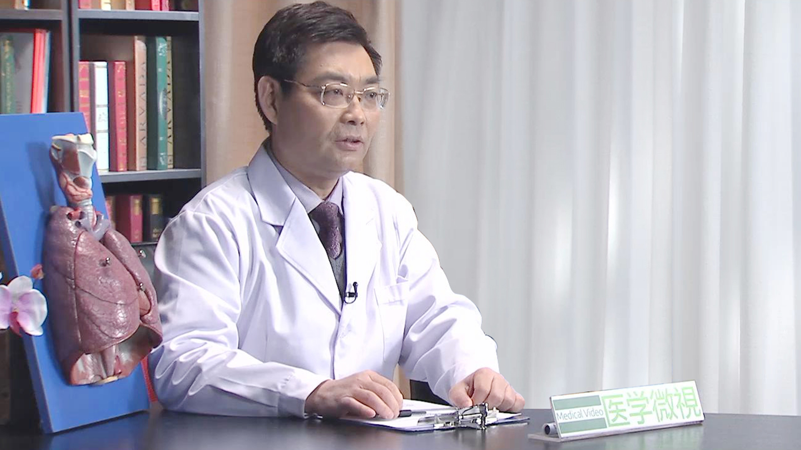

# 4.21 肺泡蛋白沉积症

---

## 徐作军 主任医师

中国医学科学院北京协和医院呼吸内科主任医师 博士生导师；

中华医学会呼吸病分会间质病学组副组长；中国医师协会中西医结合呼吸专业委员会常委；中华医学会医疗事故鉴定委员会 专家；北京医师协会内科分会理事；北京中西医结合学会呼吸专业委员会常委；北京医学会呼吸病分会慢阻肺（COPD）学组副组长；《中华结核和呼吸杂志》、《中华老年医学杂志》、《Chinese Medical Journal》、《The Lancet Respiratory Medicine（中文版）》、《中华全科医学》、《中国实用内科杂志》、《中国呼吸与危重症监护杂志》、《结核病与肺部健康杂志》等编委； 《中华结核和呼吸杂志》、《中华老年医学杂志》定稿组成员。

**主要成就：** 重点研究方向是肺间质纤维化、结节病、肺部感染和急性肺损伤；主持和承担了包括国家自然基金、北京市自然基金、“十二五”国家科技支撑计划、北京市科委基金、北京市首都医学发展科技基金和教育部博士点基金等科研项目十一项，发表论文126篇， 参加了31本专著的编写。曾获北京市科学技术进步一等奖1项，中华医学科技二等奖1项，北京市高等教育教学成果一等奖1项。

**专业特长：** 擅长呼吸系统疾病，重点为间质性肺病（包括结缔组织疾病相关性肺病）、结节病、肺部感染和急慢性肺损伤等。

---
