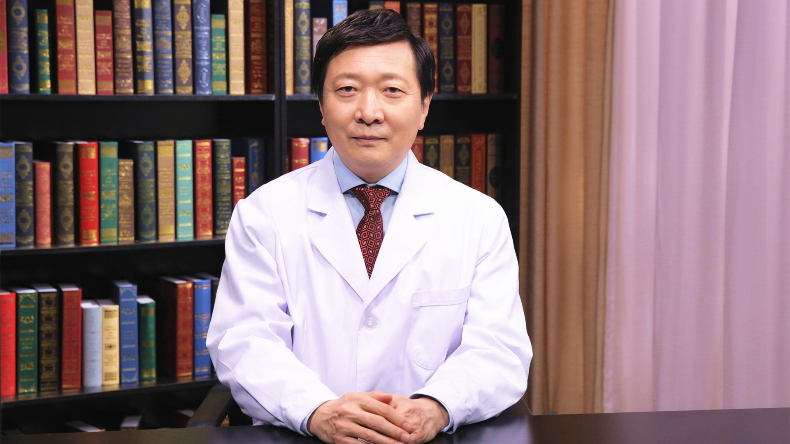

# 复发性多软骨炎

---

## 王广发 主任医师

北京大学第一医院呼吸和危重症医学科主任 主任医师 博士生导师；

卫健委呼吸内科内镜诊疗技术专家组副组长；中华医学会呼吸病学分会前常务委员 第1-3届介入呼吸病学学组组长；中国医师协会内镜医师分会副会长 呼吸内镜专家委员会侯任主任委员；美国胸科医师学会中国区理事；世界支气管和介入肺脏病学联盟执委会委员；北京医学会呼吸内镜和介入学分会主任委员。

**主要成就：** 先后获得国家自然科学基金6项、国际合作课题2项、省部级课题6项，国家863、十五攻关、985课题各1项，科技部慢病专项1项；曾获得北京市五四青年奖章、教育部科技进步二等奖，北京科技进步二等奖、三等奖；中国医师协会2018年十大优秀呼吸医师；第二届国家名医盛典（2018年度）国之名医•卓越建树奖获得者；2020年全国卫生健康系统新冠肺炎疫情防控工作先进个人。

**专业特长：** 在呼吸内镜和介入呼吸病学领域具有很高的造诣；在睡眠呼吸病、大气污染健康效应及气道炎症方面进行了系统的研究工作。

---
