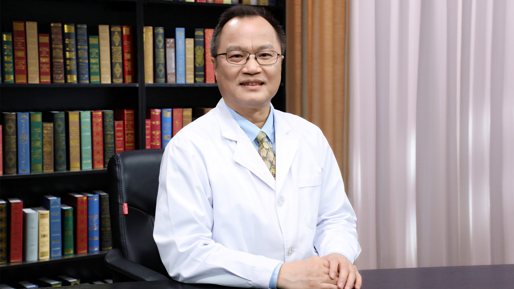

# 呼吸科症状-呼吸困难

---

## 施焕中 主任医师

首都医科大学附属北京朝阳医院呼吸与危重症学科主任 主任医师；

中国研究型医院学会过敏医学专业委员会副主任委员；中国医师协会第一届变态反应医师分会常务委员；北京医师协会变态反应专科医师分会副会长；北京医师协会变态反应学科专家委员会副主任委员；《中华医学杂志》第二十八届编委会编委；Annals of the American Thoracic Society编委；《中华哮喘杂志（电子版）》第一届编委会常务编委；《中华医学杂志英文版》第六 七 八届编委会编委；《中华内科杂志》第九 十届编委会编委；《英国医学杂志中文版》第二 三 四届编委会编委。

**主要成就：** 2019年入选“北京学者”；作为通讯作者在Am J Respir Crit Care Med、Am J Respir Cell Mol Biol、Thorax、Chest以及Eur Respir J等学术杂志发表论文90余篇；2014年获第五届北京市留学人员创新创业特别贡献奖，2015年获北京市科学技术奖二等奖，2016年获中华医学科技奖二等奖等。

**专业特长：** 长期从事肺脏免疫相关性疾病的基础和临床研究，擅长各种呼吸疑难及危重症的救治。

---
