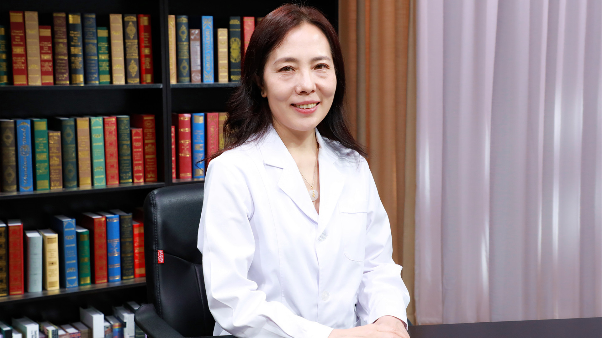

# 呼吸困难急救

---

## 米玉红 主任医师

首都医科大学附属北京安贞医院急诊重症综合监护室主任(综合组） 主任医师 医学博士；

北京急诊医学学会血栓与止血分会主任委员；中国老年医学会急诊医学分会营养学学术工作委员会主任委员；中国老年保健协会与老年保健专业委员会副主任委员；中华医学会急诊医学分会危重症学组委员；中国心肺复苏培训指导委员会专家。

**主要成就：** 以第一作者或通讯作者发表论文近40篇，主要侧重呼吸衰竭机械通气治疗的心肺交互作用、静脉血栓栓塞症相关研究；参与并完成《中国心肺复苏专家共识》之静脉血栓栓塞性心搏骤停指南的制定；曾获2003年北京市优秀党员、2016年北京市三八红旗手、2019年全国巾帼建功标兵。

**专业特长：** 擅长诊疗急性心、肺血管疾病，各种原因导致的多脏器衰竭。

---
