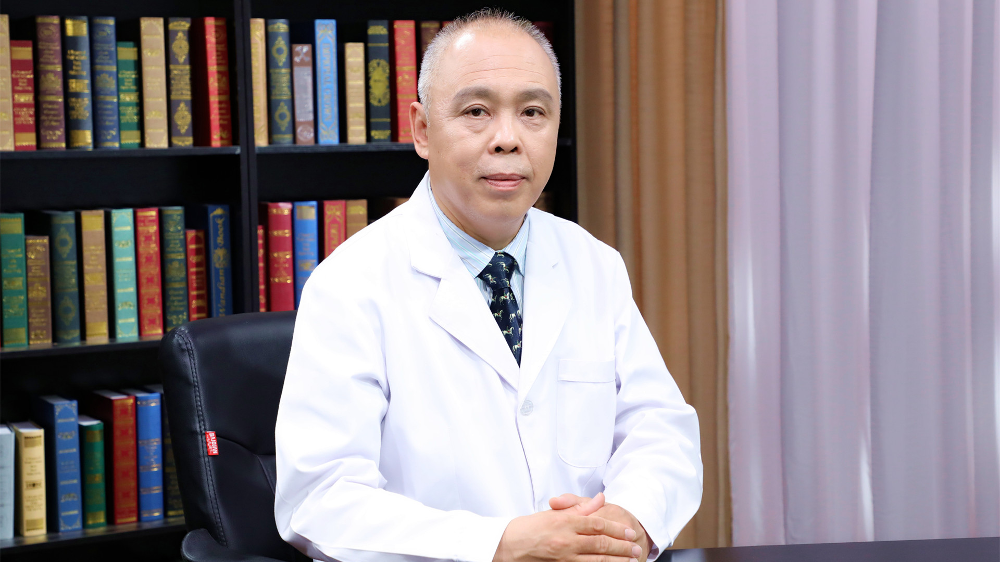

# 呼吸衰竭

---

## 马迎民 主任医师

首都医科大学附属北京佑安医院院长 党委副书记 主任医师 博士生导师 ；

中华医学会呼吸病学分会第九届委员会危重症医学组委员；中国药学会药物临床评价研究专业委员会副主任委员；中国药理学会治疗药物监测研究专业委员会常务委员；中国医药教育协会感染疾病专业委员会常务理事；北京医师协会呼吸内科专科医师分会理事；北京医学会呼吸病学分会第七届委员会常务委员；北京医学会过敏(变态)反应学分会常务委员。

**主要成就：** 入选北京市卫生系统“十百千”卫生人才计划，作为负责人承担国家自然基金、北京市医管局扬帆计划重点项目、北京市教委的首都特色、首都培育等课题的研究工作；在国内外发表文章90余篇，其中SCI收录文章近10篇，作为主编撰写专著1部；获得国家实用新型专利2项；先后获得国家科学技术进步二等奖1项、军队科学技术进步二等奖1项、军队科学技术进步三等奖1项。

**专业特长：** 擅长呼吸与危重症医学、呼吸衰竭的临床救治与研究，尤其肺部结节病变、肺间质疾病的临床诊治，急慢性呼吸衰竭的机械通气治疗。

---
