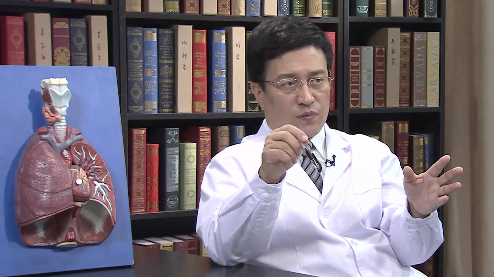

# 4.35 戒烟

---

## 支修益 主任医师

清华大学临床医学院肺癌中心主任；中国控制吸烟协会副会长兼肺癌防治专委会主任委员；

中国控制吸烟协会副会长；北京控制吸烟协会副会长；北京健康教育协会副会长；北京医学奖励基金会副理事长；北京光大东方医学研究院院长；中国癌症基金会肿瘤防控与科普部部长；中国抗癌协会科普专业委员会主任委员；中国医药教育协会肺癌医学教育委员会主委。

**主要成就：** 2017年获“华夏医学科技奖一等奖”，2018年获“中华医学科技奖一等奖”，2019年获 “国家科技进步二等奖”，2020年获“第二届全国创新争先奖”；《中国胸心血管外科临床杂志》《中华普胸外科电子杂志》《中国医学前沿电子杂志》《肿瘤研究与临床杂志》副主编，《中国肺癌杂志》常务编委；近20年来，致力于中国控烟与肺癌防治事业，积极宣传控烟与肺癌防治健康科普知识，得到了政府和社会各界的好评。

**专业特长：** 从事肺癌早诊早治、外科手术和多学科综合治疗38年；擅长肺部小结节诊断与鉴别诊断、早期肺癌外科手术及CT引导下射频消融或微波消融、晚期肺癌多学科综合治疗和基因检测指导下的肺癌个体化治疗等。

---

## 长期吸烟，肺真的会变黑吗？会有什么明显变化？

（采访）我们经常在网上看见一些照片，长期吸烟的人，肺的颜色会变黑，主任，真的是这样子的吗？

答案是肯定的。

如果吸烟的支数很多，烟龄很长，我们称之为吸烟指数越高，肺的颜色由粉色、深粉色、黑色的比例，颜色加重，其实很多做肺癌手术的胸外科医生，看到很多肺颜色就是变黑了。所以我也希望更多的烟民朋友，要正视肺的保护，如果每天吸烟超过20支，连续吸烟20年以上，比如30年、40年，肺的颜色肯定会越来越深。

另外，不仅仅是颜色深，其实更多的是肺的弹性明显减低。如果一个二三十岁的正常年轻人，一吸一呼之间，整个肺的上下幅度能达到两三个肋间。但如果你总是吸烟，肺功能降低，肺的弹性也降低，有时候一个肋间都不到。

有一些慢性阻塞性肺气肿的烟民朋友，他们肺的移动幅度连一个肋间都没有，所以没有有效呼吸的时候，其实这种慢性的缺氧状态，还会影响我们的心脏功能，影响全身各个器官的供血，所以我也希望烟民朋友们要重视这个问题。

所以答案是肯定的，如果您的烟龄越长，吸烟指数越高，肺的颜色就会越深，就是黑色的肺，同时肺的弹性也会越差。

（采访）主任，长期吸烟的人，肺的颜色变化，我们通过影像学检查能看出来吗？

影像只是看整个肺的质量，通透性、清晰度，包括我们看看双肺的肋膈角是不是锐角，同时也能看到肺的纹理情况，直接看颜色肯定是不行的，我们得通过手术来看肺的颜色，但是通过肺的质量、通透率，吸烟的烟龄是能看出来的。

如果你是一个老烟民，抽烟三四十年，一天一两包，整体肺的纹理也要增粗，而且特别是整个肺的边缘部位，正常是没有肺纹理的，也开始有肺纹理了，因为很多我们照胸片、CT的时候，一定要深吸气、憋住，从那一刹那来看，整体肺的质量就能看出重度烟民跟普通烟民之间的区别。

（采访）主任，您提到的长期吸烟还会导致肺的弹性变差，弹性变差，我们从什么样的检查能看出来？

肺功能，比如正常像我们这个年龄，不管是50后、60后、70后，现在很多80后、90后，上三四层楼根本不会喘，一吸气的过程中吸入更多的氧气，呼出体内排出的二氧化碳，使我们每个器官都处在活力状态，脑不缺血，心血管也很好，各个肌肉、各个器官都有很好的血液供应，我们就是一个活力很旺盛的年轻人或者中青年人。

但如果您是个老烟民朋友，您就向中老年迈进，因为抽了三四十年烟，肺弹性下降以后，在一呼一吸的过程中，没有完成我们赋予肺功能的任务。

吸也没吸进去这么多氧气，呼也没呼出那么多二氧化碳，一次不行只能增加次数，呼吸变浅、节奏变快，这些其实都是老慢支、肺气肿的重要指征。

而这个人还很年轻，叫你老慢支，才三四十岁、四五十岁。所以其实很多科普镜头、科普视频，展示过老烟民、老烟枪得了肺癌以后的肺，不用和婴幼儿的肺去比，和青少年同志的比，和青年人去比，或者和不吸烟的女同志比，也有很大的差别。

其实吸烟对健康的影响，对肺的影响，跟对心血管影响一样，我记得前几年的科普宣传，70岁的人，有50岁的心脏，心功能很好，通过健身，通过健康的生活方式，能让一个很好的心脏支撑我们的生命，维系我们的生命。

其实肺也是我们生命重要的维持器官，我特别希望如果你不吸烟，保护好肺，让一个70岁、80岁的人有一个50岁、60岁的肺，其实也非常重要。

---

## 长期吸烟的人，能通过“洗肺”把脏东西洗出来吗？

（采访）主任，网上也有一些说法，说长期吸烟的人可以通过洗肺，把肺里的脏东西洗掉，这是真的吗？

那肯定是假的。

我们知道喝酒喝多了，吃东西不舒服了，甚至有些意外情况可以洗胃，洗就是洗嘛，三点水，要洗就得有水，我们做所有大的手术之前，要洗肠、灌肠，保证手术以后有一个正常、畅通的排泄系统、代谢功能。

洗肺是拿出来洗？还是在里边洗？我们知道游泳溺水能淹死，水一多，肺的功能就体现不出来了，所以洗肺是个概念，就像我们更新知识，头脑风暴，洗脑一样，它只是概念。而不是一个方法学，更没有这方面的技术。

你想想如果一个弹性很不好的肺，颜色越来越黑、越来越深的一个肺，通过“洗肺”洗粉了、弹性恢复了，现在没有这种科学技术，当然我们也期待着这样的技术，但是目前没有。

开始吸烟的年龄越早，烟龄越长，肺的颜色就越深，肺的功能就越差，肺的弹性就越差，最终会影响整体的生活质量，和各个器官的功能状态。但是如果通过我们很好的有氧代谢，正常的健身锻炼，再通过戒烟，就可以确确实实能达到一个带有引号的“洗肺”作用。

---

## 戒烟后，肺功能会恢复到原来的样子吗？

（采访）主任，当烟民戒烟之后，肺的颜色、功能或者弹性能不能变回以前那样。

首先取决于他的吸烟指数，比如已经七八十岁了，抽烟五六十年，戒烟只是对健康带来相应的一些好处。

比如老烟民、老烟枪、老慢支，抽烟引起慢性咳嗽，上楼会喘，甚至走路快了都喘，如果及时戒掉烟草，戒烟以后的一天、一个星期、一个月、一年，整体的呼吸状态都会有明显改变，这不仅仅是我们中国的数字，每个国家在呼吸、戒烟门诊上，都能看出由于成功戒烟，在戒烟的不同时间都有不同的改观。

至于说让他肺功能改善，肺部颜色变浅，其实只要不继续加深，本身就是对肺的保护。

另外很多吸烟相关的疾病，比如肺癌，你在戒烟15年以后，就相当于没有吸烟行为人群的肺癌发病率，像心脏病、心血管系统疾病，吸烟相关疾病，心血管、脑血管、呼吸系统疾病，随着戒烟的时间越长，患吸烟相关疾病的风险就越低。

以肺癌为例，我们定的是15年。如果你20岁抽烟，抽到55岁，你得肺癌的几率要明显高于不吸烟人群。但是如果你55岁开始戒烟，到了70岁，这时候得肺癌的风险，几乎跟正常人差不多，这一点很重要。

当然，吸烟不是肺癌唯一的致病因素，还有室外的空气污染，室内的空气污染、遗传因素，还有我们内在的心理因素，所以我叫三霾五气，不仅仅是室外的大气污染，还有室内的空气污染，包括烟草烟气，所以我们在做控烟宣传的同时，每种疾病都是由多元素组成。

但是有一点是肯定的，只要你戒烟，戒烟的年数越多，到老年时代的时候，幸福指数就越高。

---

## 戒烟能延长寿命吗？

（采访）主任，吸烟的人群，如果戒烟的时间越长，他的寿命是不是也会有所延长？

那是肯定的。如果你戒烟5年，减少由吸烟带来的一些相关疾病的症状，慢性咳嗽、老慢支的症状缓解，但是有些人戒烟，他不仅仅是只戒烟了，他开始去健身，退休以后他开始快步走、开始慢跑，开始做一些有助于心血管、有助于肺功能的锻炼，整体的寿命就是延长的。

只要有了戒烟的想法，就说明他有了想健康、想长寿的一些计划，如果真正有行动了，真戒烟了，随着戒烟的时间、戒烟龄的延长，他的健康状态当然会有更好地改善，各个主要脏器的功能也会得到很好地改善。

如果心、肝、脾、肾、心脑系统都很好，你想想当然是长寿的，健康的生活方式，还有愉快的心情，他如果是个烟民，戒掉烟草，相应的饮食，他也会安排得更加合理，锻炼也会排出时间，心理也会更加健康，所以这几个因素同时推进，不长寿才怪。

（采访）所以我们总说学习什么时候都不算晚，其实戒烟也是，只要你戒烟了，一定是对健康有所帮助的。

对。从世界卫生组织到我们国家卫生部、卫计委，到现在的国家卫生健康委员会，和我们中国控制吸烟协会，各省的抗癌协会，我们给出一个很好的建议，戒烟任何时候都不晚。

如果你在中老年阶段能戒掉烟草，现在随着人的平均预期寿命值的延长，那就是给你的晚年生活，带来更多快乐指数、幸福指数。

即使你60岁戒烟，平均预期寿命值在我们中国，像北京已经超过了80岁，如果现在你60岁，至少还有20年，还要跟家人享受快乐生活，而目前很多城市的老人，寿命都在90岁以上，再改掉一些生活习惯，重视饮食、加强锻炼、戒掉烟草，轻轻松松100岁。

其实人本身的预期寿命值都是百岁以上，正是由于各种疾病、各种意外，各种器官的衰退，才导致目前我们有80岁、83岁，这样的平均预期寿命值。

所以我相信随着生活方式的改善，环境的改善，还有好的健康理念，其实轻轻松松100岁不是难事。

---

## 吸烟的人为什么经常咳嗽？要注意什么？

（采访）主任，为什么吸烟的人，很多人都会出现咳嗽或者多痰的情况。

肺是一个跟外界相通的器官，即使你不吸烟，如果长时间工作在石油、水泥、化工、煤炭，或者经过一个工地，都会影响我们的肺。

当然更多大的颗粒，呼吸系统有一个自我保护的机制，大的颗粒通过鼻毛，可以挡在我们的气管以外，但是PM10，粒径＜10微米的颗粒，就可以进入到气管，而气管内壁上有很多纤毛组织，像警卫团、警卫营的护卫师一样，阻止很多PM10以上的颗粒进到肺里面，但是吸烟就不是。

我们现在空气质量的标准是PM2.5，PM2.5的颗粒就是直径小于2.5微米的颗粒，它可以通过鼻腔，通过气管进到支气管，进到肺组织，而烟草颗粒直径小于2.5微米，躲过鼻黏膜，躲过气管纤毛，直接进到肺里。

另外，其实烟草中不仅仅是尼古丁，也不仅仅是六十多种致癌物质，它有几百种有害物质，还有几千种化学物质，对整个气管、支气管黏膜有刺激。

长时间吸烟，支气管黏膜，气管的纤毛功能下降，正常颗粒过来能挡一下，老吸烟，吸烟量太大了以后，挡不住的时候，鼻纤毛的功能开始下降，气管的纤毛功能开始丧失，来什么敌人都可以随便进入肺，就会产生各种症状。

而在这个过程中，最常见的症状就是咳嗽，它是一种反射，如果长时间吸烟，就会导致慢性的咳嗽，所以很多老烟民，六七十岁、七八十岁，他有慢性咳嗽根本不在意，认为就是抽烟抽多了，有点累了，其实有些咳嗽如果声音发生变化，痰的性质发生变化，这是一种疾病的信号。

如果我从来不吸烟，也没有慢性咳嗽，突然咳嗽，刺激性咳嗽、咳血丝痰，第一、咳嗽以后会警惕，第二、看到痰有血丝更会警惕，能及时到医院去检查，一看可能是早期中心型肺癌，能发现早期癌症。

但对于很多烟民，咳嗽好多年，十几年、二十多年，想都不会想咳嗽会有问题，痰也不看，每天都慢性咳嗽、咳痰，不吐到餐巾纸上、面巾纸上，不吐到洗手池上或马桶上，他看不见痰的性状，旁边有个树坑吐出去了，土地上吐出去了，现在很多人不在室内吐痰，室内吐痰能看得见痰中带血丝，室外吐痰看不见，所以咳嗽的性质发生改变，他也不在意，咳痰里边有血丝也不在意。

很多烟民本来就是得肺癌的高危人群，得了以后还没早期发现，所以在这里，我想告诉那些烟民朋友们，如果您是老烟民、老烟枪朋友，又有慢性咳嗽，只要您咳嗽的声音发生变化，您正常咳痰有点小痰、有点黄痰或者有白色痰的时候，又发现有血丝，也要警惕。

其实很多家人，很多烟民的朋友能听出来，咳嗽的声音不对，自己却认为没事，自己觉得是这两天累了，抽烟抽多了，其实别人都听出来了，他自己不觉得。所以我也建议那些烟民朋友们，如果你咳嗽的性质、声音都发生变化，咳痰的内含物也觉得变深了，里边有血丝，甚至有血块的时候，要及时到医院去检查。

还有一个建议，我希望这些烟民朋友们，每天抽烟一包以上，抽两包，烟龄在二十年以上，二三十年、三四十年的时候，每年一定要做一次胸部CT，给我们的肺看一看，是颜色深也好，整个肺的质量发生变化也好，同时也能够及时发现，早期的肺部疾病，包括肺癌。

（采访）咳嗽、咳痰本身就是我们自己的防御机制可能已经被破坏了。

对。

（采访）大家不要把它当做一个习惯，发生了一些变化，一定要及时去看医生。

是的。

---

## 长期吸烟，感觉胸闷、气短可能是怎么回事呢？

（采访）主任，如果长期吸烟的人除了咳嗽、咳痰之外，还出现了胸闷气短，可能是怎么回事呢？

首先如果长时间吸烟，随着烟龄的增加和吸烟指数的增加，肯定会影响肺的质量。其实肺是由很多肺泡组成的，是由1个细胞、100个细胞，形成了肺组织，肺组织以后是细支气管，然后是肺段支气管、肺叶支气管，到形成大的气管，这么一整个呼吸系统。

如果长时间吸烟，既影响气管、支气管通道的黏膜改变，如果再吸的时间长了以后，整个的肺组织也会发生变化。

所以如果说针对气管、支气管的症状，主要是咳嗽、咳痰，影响了肺组织以后，除了咳痰以外，吸烟时间再长，肺弹性也下降，当然就会影响我们的呼吸功能，也影响一呼一吸的任务质量。

正常吸气，然后憋好以后，你想你的肺功能得多好，吸气之后憋不住，马上就呛咳出来，你整个是一个缺氧状态。如果随着烟龄再进一步增加，肺活量也进一步减少，就会开始出现胸闷、气短，这还是正常情况下。

当然现在随着人寿命的延长，并不是说五六十岁出现老慢支的症状，七八十岁、八九十岁，像我们中学同学，我们属于50后，已经出现老慢支了，胸闷、气短，别说上三层楼，上一层楼都得休息一会儿，所以严重影响肺的功能质量。

如果他不仅仅是个烟民，我们说老北京或者北方人，还喜欢美食，我的一个中学同学不光是吸烟，还喜欢做饭，住房条件还不是那么特别好，每天煎炸爆炒，同学一聚会，一个小时，一桌菜出来了，我一看厨房，抽油烟机也不怎么开，即使开着，我听声音至少不好，一进去看的时候，跟沙尘暴天气似的，我一看厨房的油烟指数也在增高。

所以很多人不仅仅是单一吸烟的问题，很多因素也影响肺的质量，如果这几个因素相加，就出现了肺的质量整体下降，肺功能整体下降的时候，胸闷、气短的症状自然就伴随而来。

另外一种，如果出现了疾病状态，出现肺癌，出现胸水，出现各种肺的实质改变，或者你就是肺炎，一样也会胸闷、气短，其实我们长时间大量吸食烟草，也同样会影响我们细胞的功能，影响肺的功能，也会出现胸闷、气短。

（采访）我们说的咳嗽、咳痰是影响了我们的气道功能，但是如果已经出现了胸闷、气短，就是已经影响到我们肺的功能。

对，其实每个器官都有它特定的一些表现，胃肠不好，比如恶心、厌食、呕吐、便秘、腹泻，而呼吸道表现，其实就是您刚才讲的4个，咳嗽、咳痰、胸闷、气短，等到了胸疼，有些是疾病的一个明显信号，如果是心前区疼痛，是心脏疾病的明显症状。

所以我也希望更多的烟民，要关注咳嗽、咳痰、胸闷、气短，有了这些症状，也应该到呼吸科，或者胸外科，或者社区医生那儿做一次健康体检，有一个健康档案，做一个胸部CT，给肺留个底板。

---

## 吸烟与肺癌的关系到底有多大？

（采访）主任，我们总说吸烟是肺癌的罪魁祸首，吸烟和肺癌到底有什么样的关系呢？

谈到肺癌，我想普及一点基本常识，肺癌就是原发于肺部的恶性肿瘤，根据发病的部位，我们分成了中心型肺癌和周围型肺癌。中心型肺癌就是长在气管、支气管、肺叶支气管、肺段支气管，长到管腔里的肿瘤，叫中心型肺癌。而长在肺野里面的，肺组织里面的肺癌，叫周围型肺癌，这是按部位划分。

另外，我们也像划分男女性别一样，肺癌也按照病理类型，分成了小细胞肺癌和非小细胞肺癌，而非小细胞肺癌细分，又分腺癌、鳞癌，不用记那么多，但至少知道分小细胞和非小细胞肺癌，这跟性别男女一样。

如果是中心型的，如果是小细胞肺癌，跟吸烟密切相关，直接吸烟就能导致中心型肺癌的发病率明显高于非吸烟人群。

但如果我们长时间吸烟，吸的还深，这个人心情不好、抽闷烟，所以很多烟民说我没吸进去，我吐个烟圈就出去了，很多心情不好的时候，无论生活、事业、婚姻、家庭不顺的时候，这种烟全吸到肺里面以后再出来，那真叫用烟来洗肺，这时候同样也会影响周围型肺癌的发病率。

所以吸烟有害健康是一个不争的事实，吸烟跟肺癌的关系也是几十年得到的证据。看到我们临床这么多年的数据，看到《中国临床戒烟指南》中的科学依据，以及原发性肺癌诊疗规范里面的相关数字，都强调80%以上的肺癌，甚至85%以上的肺癌都跟吸烟密切相关。

无论是一手烟、二手烟，现在还有三手烟的概念，所以我们想告知我们的烟民朋友，吸烟跟肺癌是有肯定关系的，当然更加密切的是中心型肺癌，95%以上的小细胞肺癌都跟吸烟有肯定的关系，因果关系。

现在随着健康体检的增加，随着胸部CT的普及，很多不吸烟的女性肺癌的上升，也确实引起了我们搞肺癌的医务工作者，搞控烟的公共卫生专家的关注，不吸烟的人，为什么发病率也在上升？

其实跟我们健康理念，跟我们健康体检，肺癌筛查，胸部CT的应用也有密切关系，这等于由于构成比的因素发生了变化，好像不吸烟也得肺癌，吸烟也得肺癌，我们还是抽吧，这是不对的。

吸烟得的肺癌更多的是中心型的小细胞肺癌，现在女性不吸烟得的肺癌，更多的是周围型的肺腺癌。

---

## 为什么不吸烟的女性也会得肺癌？

（采访）主任，为什么不吸烟的女性也会得肺癌？

这也是目前我们医学在关注的一个现象，很多国家，包括北京、上海、广州等很多省份，我们也在做相关流行病数字的调查，但是其实很多不吸烟女性得肺癌，跟长时间遭受二手烟，跟厨房油烟，跟室外的大气、空气污染，其实还有三霾五气，更多的跟女性有密切关系。

外出购物女性多，如果雾霾天气、重度空气污染的时候，还那么常规去购物的话，在室外停留时间长。无论是公园散步，还是早晨的晨练，有雾霾的时候，不要晨练、少出门。

明确地告诉大家，目前的可吸入颗粒物，PM2.5已经定义为一类致癌物质，所以在整个雾霾天气的过程中，在整个PM2.5超标的地区，外出时还是建议大家戴口罩，严重的雾霾天气或者雾霾天气的时候，尽量不要外出，如果必须外出、戴口罩，必须外出、尽量减少停留的时间。

不仅仅是这样，回家以后，因为我们头发上也粘到雾霾的成分，我们衣服上也有，就像二手烟一样，雾霾也有二手雾霾，所以回家以后，把衣服先放在门口放一放。如果回去再冲个头、洗个澡，这都是很好的预防措施。

一次、两次没关系，但是如果在雾霾的高发地区、频发地区，你回来以后就把衣服放到衣柜里，也不洗手、也不洗头，就在整个房间里正常地生活、工作，肯定会对室内的空气质量带来危害。2020年新冠疫情让我们知道戴口罩了，等新冠疫情完全过去了，控制住了，到了雾霾天气，也要戴口罩，这也是一个方面。

另外就是二手烟。这几十年来，无论是中国的、日本的、亚洲的、欧洲的、北美的，我们也发现越来越多的证据，二手烟跟肺癌的发生也有关系。

因为烟草中有三千多种化学物质，几百种有害物质，明确的致癌物质有69种，如果你长时间遭受二手烟的暴露，相当于一个主动的轻度吸烟者。

像很多夫妻两口子，老公老是抽烟、老烟枪，然后到了晚年，因为长时间生活、工作在一起，我们的控烟措施、控烟立法也没有包括家庭，在家里哪都抽烟，有些女同志对男同志管得严点，让他去阳台，阳台也封闭了，让他们去卫生间，卫生间别人也会进去，还会有二手烟。

这些烟草产生的烟雾，二手烟、三手烟，对不吸烟的女性也带来健康危害，是不当着你的面吸烟了，现在随着很多控烟立法城市的出现，很多人的健康意识提高，还有很多烟民也有自觉性了，我不当着你的面吸烟。

夫人回家之前我抽烟，一进门不抽了，孩子回家以后我不抽烟，回来之前我抽烟，外孙子幼儿园下学之前，我在家吸烟，回来了我不抽了，但你不知道这个房间里面，无论是地毯、沙发、窗帘、床上用品、身上的衣物、烟民的头发、皮肤，都有烟草烟雾的沉积，而这些叫三手烟。

对支气管哮喘、老慢支患者，或者对孕妇、儿童的危害也很大。你去出差住酒店，前面那个房客是个烟民，没有当着你的面抽烟，坐出租车，前面乘客下去了，他一直抽烟，他也没当着你的面吸烟，这些三手烟同样影响我们的肺健康。

厨房也一样，所以如果是一个新装修的房屋，还有一些苯和甲醛的因素。当然，现在不吸烟的女性得肺腺癌，还有遗传因素、内分泌因素，还有雌激素、孕激素的因素，我们都是在研究的过程当中。

（采访）过往我们以为吸烟的人当着面吸，跟他共处一室，我们吸到了二手烟会影响健康，没想到他在这个空间里面吸过烟，在这个环境里留下的，身上留下的，床单、被罩留下的烟草烟雾，也会对我们的健康有影响。

这是肯定的，我们就以出租车为例，您上出租车了，上个同志从北京开到通县，一路抽烟，他下车了，您从通县到北关环岛，20分钟您遭受三手烟暴露。餐馆，你前面那桌的食客们在抽着烟，你们十个人进入单间里边，也在遭受三手烟的暴露。

所以我们也希望烟民朋友，无论是当着人，还是不当着人，都不要在室内公共场所吸烟，因为会让别人遭受二手烟和三手烟的暴露。

---

## 什么是吸烟指数？超过多少要筛查肺癌？

（采访）主任，对于吸烟的人，是不是一个肺癌的高危人群，我们可以通过吸烟指数来判断，您能给我们介绍一下这个是怎么计算的吗？

如果我们要进行肺癌的筛查，我们要锁定肺癌的高危人群，而高危人群是有定义的。

首先是年龄，不能二三十岁就给人做肺癌筛查，就职体检、结婚体检也去做CT，所以有年龄因素，更多的国家都在五十岁以上。第二，吸烟指数。第三，既往有没有肺部疾病的历史。第四，有没有肿瘤或者肺癌家族史。第五，有没有环境职业的暴露因素，还有相关的因素，所以吸烟指数是一个重要的指标。

什么是吸烟指数呢？就是每天吸烟的支数×吸烟的烟龄，这就是吸烟指数，如果大于400，就定义为肺癌的高危人群，我们做肺癌筛查的时候，必须是吸烟指数大于400，有些国家大于600。

什么意思呢？就是每天吸烟超过一包、20支，连续吸烟超过20年，或者30年或者40年，至少你是大于400，至于600、800、1000，那是另外一回事，得大于400，你才针对这些人群进行胸部CT的肺癌筛查，所以吸烟指数非常重要，但有些人每天抽10支，抽30年、40年，还是不一样。

所以我还是认为随着我们寿命的延长，如果你不戒掉烟草，你的吸烟指数肯定会逐渐升高，所以有时候说，不是不报、时候未到，等你抽了50年烟的时候，吸烟指数上升了，等你到了76岁、86岁的时候，我们身体状况还挺好的时候，但是免疫机制下降了。

一方面抵抗疾病能力的免疫机制，到60岁以后开始往下走，有些身体好点，70岁以后往下走；另一方面，吸烟的指数一直往上走，致病的因素一直往上走。抵抗疾病、防御疾病的免疫机制往下走，致病因素往上走的时候，就跟掰腕子似的，它就压过你了。虽然有很多因素，但吸烟指数越高，得肺癌的几率肯定越高，这是不争的事实。

（采访）主任，您提到了肺癌的高危因素有五点，是不是这五点都要符合才去做筛查，还是只要符合一点我们就要做筛查了？

其实符合一点就是一个高危因素，像现在很多单位的健康体检，职工保健超过55岁以上的，开始加做胸部CT，如果是55岁以前的，就做胸片。

最早的时候，像我们刚大学体检的时候，那时候还做胸透呢，还没有CT，1978年上大学没有CT，CT是20世纪90年代的产物，现在又有了PET/CT，所以科技在发展，我们对疾病的认识也在提高，所以只要是年龄大了，像我们宣武医院2021年的体检，超过50岁所有同志们，都由胸片换成胸部CT。

当然根据自己的选择，说我没事，如果你没有家族史，又不吸烟，55岁再做胸部CT也可以，但是如果几个因素相加，都在一起，又超过50岁，又有吸烟史、家族史，工作或生活在石油、水泥、化工、煤炭这样的地区，你当然要做胸部CT，即使没有政府的筛查项目，就自己的角度而言，你也应该查肝肾功能，看肝脏功能、肾功能怎么样，查心肺功能看心肺功能怎么样。

用胸部CT给我们双肺留个底板，肺功能状态怎么样，所以我认为这些高危因素如果叠加，你更应该用胸部CT给我们的肺留张底板。

---

## 与直接吸烟相比，二手烟的危害小一些吗？

（采访）主任，跟直接吸烟相比，二手烟的危害是更小，还是更大一些？

这其实这是一个很好的问题，因为在这几年的控烟宣传中，经常说二手烟比一手烟还厉害，我想从整体烟草对健康的危害，肯定排序是一手烟、二手烟、三手烟的这种排序。

但是，其实长时间让别人遭受二手烟，是一个不道德的行为，而你抽烟，甭管有多少个借口，抽烟提神，抽烟的各种理由，我们也不反对，每个人都有自己的权利，但你要当着我的面抽烟，你还那么多理由，这是不对的。

当时社会传，二手烟比一手烟还厉害，就是它里边的重金属，因为烟草中有几千种化学物质，几百种有害物质，69种致癌物质，我们说重金属，如果我主动抽烟，烟头的温度能达到700多度，所以烟草里边的那些重金属，确实随着高温溶解代谢。

但如果我不抽烟，我叼着，让它冒着，有些人把烟放在烟灰缸上，往那一放，让它自燃，这种烟的温度就到不了700多度，所以有些重金属因素，随着烟的自然燃烧，也会释放出来，这是所说的这种二手烟雾。

还有侧流烟，我吸完烟以后，从这儿再吐出来以后，同样有这些致癌物质，而这种二手烟，不管怎么样，如果我就是想吸烟，又那么多理由，我还满足了我的心理需求，身体需求，还挺愉悦。

从二手烟烟草中，得到的全是有害物质。当然作为一个没有认为从烟草、烟雾中获得快感的时候，这只是负能量，所以让人家遭受二手烟的暴露，三手烟的暴露，肯定是不道德的行为。特别是在控烟立法的城市，像北京、上海、杭州、西安，已经在室内禁止吸烟，严禁在室内抽烟，你还抽烟，不仅仅是不道德了，你都犯法了。

写着严禁吸烟，吸烟要罚钱、要举报的时候，还不自觉地抽，第二、跟他在一个房间吃饭的亲人、同事也不举报，也不对他说个不字。

所以目前也是我们控烟立法出台以后，在执法方面的一个难度，所以我也希望那些不吸烟的人，遭受二手烟暴露的时候，也要拿出法律来，拿出控烟立法来捍卫自己的权利。

---

## 过滤嘴真能降低吸烟的危害吗？

（采访）主任，对于吸烟的人，很多人认为装上一次性的过滤嘴就能减少吸烟的危害，这个是有道理的吗？

这个问题已经争论了四十年。过滤嘴是装了一个过滤装置，其实在烟草公司，它叫低焦油含量，通过过滤减少焦油进入体内的量。

其实在四十年前（1980年前后），我在首都医科大学附属北京朝阳医院临床实习的时候，就参加了翁心植，我们国家的控烟之父，翁心植院士当时做生产低焦油卷烟健康监测的临床研究。

那个时候我们认为，挺好，如果抽正常卷烟，卷大烟炮变成了有过滤嘴，肯定能降低危害，当时烟草公司也确确实实提出了这个口号，让更多的年轻女性成为烟民，让更多的吸烟人降低警惕，认为低焦油、低危害。

如果说二十年前（2020年前后）没有这些结论证据的话，四五十年都过去了，我们真没有看到因为低焦油，而减少吸烟相关疾病。所以现在看来，低焦油等于低危害，这是烟草公司的一个骗局。

还有一点，所谓的过滤嘴，它低焦油的含量，是把这个过滤嘴插到机器上去测，你看低焦油了，因为好多焦油都在过滤嘴上，但是每个人的吸烟行为不同，大家注意一下，如果这个笔帽就是过滤嘴的话，烟没这么长，不管这么抽，还是这么抽，正好堵住过滤嘴的那些孔道的时候，其实也没有降低多少焦油。

当然还有其他的一些数据，看你吸烟的量、吸烟的指数、吸烟时的心情、吸烟的方式，有很多的证据表明，低焦油没有降低对吸烟相关疾病的影响，同时，其实让每一个烟民还放松了警惕。

特别是现在低焦油的这种过滤嘴烟，有的做成时尚烟，让更多年轻的女性沾上烟草，成为了尼古丁的依赖者。四五十岁、五六十岁、七八十岁的老太太、老奶奶、老大姐们，还在抽着烟，已经成瘾了。

所以我也希望，第一，烟草公司不要向青少年推销烟草，另外也不要打出低焦油、低危害的口号，去让很多的年轻女性吸食烟草，这一点我也希望能够传递出去。

---

## 电子烟对健康真的无害吗？

（采访）主任，近年来电子烟也非常流行，宣称没有焦油，对健康没有危害，这是真的吗？

烟草中有几百种有害物质，69种致癌物质，而它的罪魁祸首是尼古丁，它让人成瘾，所以在吸食尼古丁的过程中，这种有害物质随之而来，致癌物质随之积累。

如果电子烟只是一个尼古丁传送系统的装置，只输送尼古丁，然后没有烟草中其他有害物质，当然我认为这一点是低毒、低危害的。而这个对象是谁？当时生产电子烟也好，生产戒烟药也好，药是有适应证的，一定是吸烟指数超过了400、800，尼古丁依赖程度是中度或重度，我才给你使用戒烟药物，戒烟药物是首选。

现在电子烟的目的是有吸烟行为，因为有的人还是有吸烟动作、吸烟行为，像英国把它列入了医保，既然能列入医保，药品是有适应证的，是由医生开具的，他一定有吸烟指数，甚至很多人是由于吃了戒烟药都不行，还对尼古丁重度依赖，完全可以用这种只有尼古丁含量的电子的尼古丁传送系统来帮助你戒烟，这是一个过程，我认为它有它的道理。

但是现在（2021年）整个全球，方向出现了偏移，根本不是为了帮助烟民戒烟而生产的电子烟，是为了让年轻人觉得它酷，还没有吸食传统卷烟的青少年，先沾上电子烟，先沾上尼古丁，最后他对尼古丁产生依赖以后，进而去抽传统卷烟。

另外，针对像北京、上海，有了室内禁烟的控烟法规的时候，在室内不让他抽烟，北京的控烟法规，2015年电子烟还没有这么昌盛的时候，就没有把电子烟列到控烟法规当中，所以在室外能抽烟的地方抽传统卷烟，室内不让抽传统卷烟时抽电子烟，所以也没有达到戒烟的作用。

现在又出现了新的变化，电子烟就是一个电子的尼古丁输送系统，只是尼古丁，没有任何其他物质，现在又出现了更多其他的第二类电子烟，它有添加剂，你想抽薄荷味，他给你添加薄荷，可不是真薄荷，是化工合成的薄荷味的物质，咖啡味挺好，给你加咖啡味，这边抽着尼古丁，这边加上一些添加剂，这些目前是一个新的动向。

如果把这些不是给老烟民、老烟枪戒烟用的事儿，瞄准青少年是培养烟民的时候，这个行为更加不道德。让更多人类的后代、希望，现在形成了尼古丁的依赖者，等他到了18岁、到了可以买卷烟的时候，他自然成为卷烟的烟民。

所以作为中国和北京市控制吸烟协会的副会长，作为一个肺癌的医生，我们对目前的烟草公司也好，电子烟的生产厂家也好，去瞄准青少年生产，兜售给青少年的这个行为，我们是严厉谴责的、态度鲜明的。

如果有些国家、有些地区，是出于想帮助那些通过戒烟药物还挺难的这种烟民，只对尼古丁重度依赖的烟民提供点尼古丁的话，还有情可原，我们还值得探讨和研究，它到底能给我们带来什么样的好处，但是如果就是瞄准青少年，瞄准青少年女性，甚至瞄准中小学生，我都认为是犯罪行为。

2019年国家市场监督管理总局也发出了这种针对青少年兜售电子烟的相关管理措施，但是有法必依、执法必严、违法必究。我们现在看电子烟市场，它说尼古丁的含量不超过20mg，我们在2019年“三一五”，做了一个抽查，看到很多品牌的电子烟厂商，出产的电子烟，尼古丁含量已经超过20mg，写的20mg，其实是30mg。所以短时间内吸食大量尼古丁，对人的健康、心血管系统也有致命作用的。

卷烟还得一根一根抽，通过累积，通过吸烟指数带来健康的危害，如果短时间内抽大剂量的尼古丁，对心脑血管系统肯定有副作用。当然，我也坦然地去承认，由于电子烟才这几年的历史，所以它对肺癌的影响，对心血管的影响，对肺的影响，我们需要数据，传统卷烟的吸烟指数，烟龄超过20年，每天20支以上。你说电子烟，他到底抽多少支？抽多长时间？对哪种疾病有什么影响？我们需要疾病的一些数据进行研究。

但反过来，如果它就是瞄准中老年烟民，至少我们可以跟医务工作者合作，怎么能够通过电子烟，通过单纯的一个尼古丁传送系统，帮助那些难戒烟的、顽固性的，中重度的尼古丁依赖者有帮助的话，我们开始研究。但只要是瞄准不吸烟人群，你就是违法的，就要查处。

---

## “抽了一辈子烟也没得肺癌，所以没必要戒烟”能说服你吗？

（采访）主任，有一些老烟民说我抽了一辈子的烟，我也没得肺癌，那就是没有问题的，这样的说法对吗？

这种说法都是老烟民朋友自己对别人说的，都是个体。

我们是医生，我们是科技工作者，我们说一种物质对一种疾病产生影响的时候，我们是队列研究，我们用几万人，甚至几十万人，用几年，或者几十年，来研究吸烟人群跟不吸烟人群的对照，现在已经六十年过去了，明确地告诉大家，吸烟指数超过400的吸烟人群得各种相关慢性疾病的比例明显高于不吸烟人群。

我们用队列研究，我们从来没说吸烟肯定会得肺癌，吸烟如果吸烟指数超过了400，就是高危人群，得肺癌的几率要高于不吸烟人群。

我们没说吸烟肯定得肺癌，喝酒肯定得肝癌，吃不干净的东西肯定拉肚子，每个人的免疫力、抵抗力都不一样，但是如果你吃了不洁的食物，对胃肠功能的改变，胃肠功能紊乱肯定是有影响的。抽烟如果吸烟指数超过了400，得病的几率明显高于不吸烟人群，我们说概率，没说个体。

我们身边也有这样的，我们自己的亲人、同事和我们认识的烟民朋友，九十多岁了，他就是烟民，那是他个人行为，我们没有研究个人行为，在医学上的个案属于个案报道，英文叫casereport。报告的是一个奇怪的病人，奇怪的病例，我想告诉大家而已，但是这些烟民朋友们，90岁、100岁的人也有，但是我们队列研究时，肯定这是一个不健康的生活方式。

所以这些烟民朋友们找借口，找各种各样的例子，可以理解，但作为医生，作为公共卫生的一个专家，我们用数字说话，用事实说话。

（采访）那些只是个例而已。

对。

（采访）用大的数据研究能证实吸烟对健康肯定有影响。

当然我也建议说这话的同志们，你们可以做一下大数据，现在都有大数据，把十万个吸烟的90岁以上的人调出来，回顾性的研究都没关系，而我们这些研究有些是前瞻性的，有些是回顾性的，我们用大量的吸烟人群和不吸烟人群，饮酒人群和不饮酒人群，我们连续跟踪三十年、四十年、五十年，所以我们都是用这种研究的数字来提出科学的建议。

---

## 为什么戒烟很难？

其实吸烟就是一个习惯，好人不吸烟吗？好人也有坏习惯，所以确实是一个生活习惯。

如果他吸烟的年龄越早，十三四岁开始吸烟，开始吸烟的年龄越轻，吸烟的烟龄越长，每天支数越多，肯定对尼古丁的依赖程度就高。所以目前很多烟民戒烟难，所谓烟瘾都是尼古丁依赖，目前世界卫生组织已经把尼古丁依赖列入疾病，把吸烟列成了疾病，中度烟民、老烟民已经成为病人了，是成瘾性疾病，在精神疾病分类里有编号。

因为他对尼古丁成瘾，每天大脑中枢要给我提供一定量的尼古丁，所以这种依赖性疾病，就导致了烟民单靠自己戒烟就很难，特别是中重度的重度烟民，表决心不抽烟，做不到，躯体里已经成瘾了。

所以既然把长时间重度吸烟者的，中重度尼古丁依赖作为一种疾病，我们也不能只去赖烟民，在宣传吸烟有害健康的同时，在抓住源头控制青少年吸烟，不让青少年沾食烟草的同时，要对那些老烟民像爱护病人一样爱护、呵护。

第一、要说吸烟有害健康，如果你的烟龄越长、吸烟指数越高，以后得心脏病、肺癌相关疾病越高的时候，烟民想戒烟了，但是躯体不答应，大脑不答应，我们这时候要帮助人家戒烟，帮他分析，怎么早上起来非得拿那支烟，很多烟民还没睁眼，就把烟放这儿了，闭着眼睛叼好烟，闭着眼拿火都能点好，很准，小脑平衡、大脑平衡准着呢，咱们闭着眼点点不着，人家能点得着，为什么呢？

第一支烟是很重要的戒烟的标识，如果他能在睁眼起床以后，第一支烟离起床时间越远，戒烟的成功率就越高。所以我认为这些烟民想戒烟又戒不掉，首先告诉他们这是个疾病，需要戒烟门诊的帮助，需要医生的帮助。

每一个人可能说一说，每天抽十几支烟，它可以有危害，健康体检以后觉得器官有一些不正常，主动一想，也可以控制吸烟行为；但如果每天两三包，他就是再有什么想法，他要没有一种疾病，不撞到南墙，也戒不掉。

像我是搞肺癌的，很多烟民朋友没靠戒烟药戒烟了，为什么呢？肺癌了，他的注意力集中到肺癌要死，肺癌是不治之症的时候，他为了活命，为了健康，把吸烟忘掉了，住院之后也不会让他吸烟。

但反过来，早期肺癌切了，手术后两三年他又复吸了，他认为没事儿，所以我们的医生不仅仅在治病之前，要帮助烟民戒掉烟草，治病以后，还要帮助他继续戒掉烟草，远离烟草。

像胡大一教授是中国控制吸烟协会会长，刚给烟民放完个支架，烟民想反正有支架了，他又继续抽烟，没半年、没一年，第二次放支架，甚至有些烟民放了三次支架。昨天到我办公室看病的一个文艺工作者，跟我说支大夫，我放了三次支架，为什么？因为放完支架以后又再抽，抽完以后又再放。

你想想，所以我们认为我们的医生，我们的心血管医生，我们的肺癌医生，我们的呼吸科医生又告诉他得病了，给他治病的同时，让他永远远离烟草，这是我们医生的责任。

---

## 不吸烟就会觉得头晕、烦躁、想睡觉，是怎么回事？

（采访）主任，很多的烟民在不抽烟的时候，就会出现头晕、烦躁、想睡觉这样的一些症状，是身体真的出现了这些症状，还是他们的心理因素导致的。

如果中重度的吸烟者，已经定义为中重度尼古丁依赖者，他对尼古丁已经有依赖了，既然是个疾病，依赖性突然断掉的话，会有戒断症状。

一个中重度烟民，突然戒掉烟草，如果你没有给他提供相应的尼古丁替代产品，他就会出现戒断症状，这个戒断症状也是疾病，所以为什么现在把吸烟当成疾病，戒掉烟草出现戒断症状的时候，我们的医生要关心他，而且要告诉他有这个症状的可能性。

轻度的，几天以后过去了，几个星期要坚持住了，也就坚持住了，更何况北京有控烟立法，室内不让吸烟，你是一个单位的负责人，你是一个科室的负责人，如果带头抽烟，全办公室都就抽烟了，另外还有执法人员，罚单位，北京的控烟立法不罚吸烟者，罚这个地方的经营者，在餐厅抽烟，罚餐馆老板，在办公室抽烟，罚物业管理，在哪个单位，罚这个单位。

所以我们认为既然这样的时候，要告诉人家，如果中重度的，主动告诉他寻求医生的帮助，到戒烟门诊，让戒烟门诊的医护人员，帮助您成功戒掉烟草，所以我认为出现这些不适的戒断症状，我们要主动告知人家，然后再主动帮助人家，让人家成功地戒掉烟草。

---

## 戒烟以后长胖了，是怎么回事？

如果他是一个重度的烟民，已经有了重度尼古丁依赖，躯体的依赖，还有就是成习惯了，往这一坐就要拿根烟，要不这手就难受。

所以在最早没有戒烟门诊的时候，我们说你可以拿点零食吃，因为女烟民的朋友挺时尚的，我戒烟了，然后拿点东西去代替手里的烟，老头同志拿核桃转一转，健身球转一转，年轻人就是靠零食代替，一代替，体重明显增加，你看我戒烟还胖了，不戒了。

因为吸烟会影响我们的胃酶，影响消化酶，反过来，突然不抽烟了，对胃酶、消化酶、代谢酶的抑制解除了，胃口也好了、也香了，再加上零食，再不锻炼，所以很多中重度烟民，即使有了戒烟药，他有这个行为的时候，如果不重视，不控制饮食，确实有人体重会增加几斤，甚至十几斤。

如果说在决定戒烟的时候，我们的戒烟医生，戒烟门诊的医护人员告知你，怎么能够又成功地戒烟，还能够尽量避免体重的增加，如果有几斤或者小范围的体重增加也是允许的。

我认为戒烟作为烟民，就要有一定的思想准备，同时也有一个体重管理的计划，每天该怎么保证饮食，结构的调整，健身、热卡的消耗，既然你珍爱健康了，除了戒掉烟草，同时要管理饮食，要管理体重，要动起来去健身，这是几个方面。

所以戒烟为什么是个学问，还能开戒烟门诊，而不仅仅是不抽烟而已，所以我也希望既然戒烟有一定的这种刚才我说的消化酶的改变、释放，再加上吃零食等不科学的方法，再加上不注意锻炼，确实会有一些体重增加的群体，我希望我们共同努力，让戒烟的烟民朋友，成功戒烟的同时，还能有很苗条的身体。

---

## 戒烟戒不掉的人，怎么寻求医生的帮助？

作为中国控制吸烟协会，各省市都有控烟协会，我们有全国的戒烟热线，为那些想戒烟的人提供戒烟帮助，同时很多医院戒烟门诊也有戒烟热线，不一定非到门诊来。

像今天的节目，通过看我们的节目，也可以增强戒烟的意愿，通过我们这个节目，也能知道要想成功戒烟，戒烟门诊是一个很好的选择，针对那些没到那种吸烟指数的情况下，可能真的不需要戒烟药物。

有些人也没有到中重度尼古丁依赖，轻度尼古丁依赖，通过抑制、通过决心，通过环境的改变，通过控烟立法的推动，如果你是老师，有无烟学校的要求，你是医院医生，有无烟医院的具体指标，党政机关、无烟办公楼，你作为党政机关负责人你就不能抽烟，这些限制都可以让他到室外去抽烟，减少尼古丁的依赖程度，进而走向成功戒烟，其实有很多方法。

的确，随着2021年全国两会的召开，乡村振兴计划的推出，我们也希望更多的地市级以下的基层，也应该传播吸烟有害健康，戒烟有益健康这种科普常识，也希望更多的地市级医院，也能够开设戒烟门诊，同时通过传统媒体、新媒体的科普宣传、专家访谈，也通过新媒体、微信、微博，告知更多基层的烟民朋友们，怎么科学有效地戒烟，这是第一。

第二，中国控制吸烟协会，王辰院士在十年前我们一起，在他的领导下，我们就推出了《中国临床戒烟指南》，前几年又进行了更新，2021年我们还会进行更新。

《中国临床戒烟指南》不仅仅发放，这些有控烟立法的大城市，我们希望在县医院，在乡村卫生院都能读到《中国临床戒烟指南》，这是给我们全科医生，基层卫生医生帮助烟民戒烟的有效手册。

所以2021年我们也会加大《中国临床戒烟指南》的解析、推广、更新、解读、应用，甚至在以后医院的考核过程中，比如你是先进的医院或者是三甲医院，或者是医院等级评审过程中，我们都把无烟医院建设，把戒烟门诊列入进来，我想对无烟中国、健康中国都有好处。

（采访）目前对于想戒烟的人来说，如果当地没有门诊，我们可以去找大医院的戒烟热线，都能够寻求帮助。

是的。

另外一方面，我们希望以后把戒烟门诊放到社区卫生服务中心，就在小区里边，社区卫生服务中心，乡镇卫生院，就有戒烟的门诊，无论是呼吸科，还是全科医生，在整个帮助社区的健康管理方面，你就应该有这个职责。

现在很多的社区卫生院，都开始帮助社区居民建立健康档案，当然，张大妈高血压，李大爷是烟民，只要有了这种健康档案，就要进行干预，劝阻人家不吸烟，然后帮助人家成功戒烟，都应该是社区卫生院和基层医疗机构的职责。

---

## 哪些烟民需要通过药物来戒烟？

（采访）主任，对于什么样的烟民，我们可以通过药物来治疗，帮助他们戒烟。

其实更多的烟民不需要戒烟药物，因为只要有了健康评估，我现在已经是疾病的高风险，自己通过意志、决心和自己珍爱健康、关爱程度，有些人关爱家人，家人也会关爱你，有一个很好的戒烟计划，不需要戒烟药物干预。而且很多烟民一般来讲每天也没超过10支，这是第一。

第二，我们要给他做一个烟草成瘾性的评估，除了健康风险评估以外，对尼古丁的成瘾程度也要进行评估，如果是轻度的和一部分中度的，就是轻中度的尼古丁依赖，通过科学的戒烟方法，通过戒烟门诊的帮助，通过家人的帮助，我们有一套很好的戒烟方法，是可以成功戒掉烟草的，不需要戒烟药物的干预。

但如果是重度的，又没有健康危害指标，主动戒烟系数又不强，我们还要做更多的戒烟工作，而不是靠戒烟药物。但是针对那些通过各种方法，还是不成功，而且自己是中重度尼古丁依赖，我们一开始就给他戒烟药物的支持。

如果有了戒烟药物的干预，我们也要告诉他使用戒烟药物的注意事项，只要是药，可能会有一些副作用，戒烟门诊要告诉烟民戒烟药物的相关副作用，也能让烟民放松和提高依从性，其实是在珍爱自己健康的情况下，在戒烟门诊的指导下，最终也能成功戒烟。

---

## 怎样才能科学地成功戒烟？

（采访）主任，对于戒烟来说，我们怎样科学戒烟呢？

既然吸烟是一个习惯，重度吸烟又成为尼古丁依赖，成为一个病人，所以戒烟的方法是非常重要的。

如果一个烟民随时都能宣布戒烟，他的复吸率相当高，如果一个重度尼古丁依赖者，在没有戒烟门诊的帮助下，没有戒烟药物的干预下，成功率不到5%，也就是说星期一戒烟，可能星期五复吸，我1月份戒烟，5月份复吸，今年戒烟，明年复吸，因为他没有一个好方法，所以目前最大的成功戒烟，首先是烟民想戒烟，这是最重要的内因。

外因通过内因起作用，所以如果一个烟民，在没有戒烟想法的时候，我们的医务人员、戒烟门诊帮助这些人群提高戒烟意识，有5A法、5R法。反

过来如果通过我们的劝阻戒烟，建议戒烟成功以后，烟民真想戒烟了，六七十岁的烟民，一查体，心血管堵了，肺里还有阴影，血脂高，他自己也想戒烟，所以这种健康评估，加上戒烟门诊的劝阻，他真正想戒烟了，这个时候我们才开始真正戒烟的帮助。

而戒烟的帮助有很多方法，首先选好一个时间点，比如年轻人戒烟，虽然没有那么大的尼古丁依赖程度，真想戒烟，选择自己的生日，女朋友的生日，夫人的生日，儿女的生日，外孙的生日，选择重要的节点日，或者结婚纪念日，在这个点宣布戒烟，拿它当成一个工作，当成家庭重大事件来对待，这就是成功的开始。

第二是广而告之，自己先戒烟，戒烟成功了以后我再跟谁说，那叫什么戒烟呢？广而告之，在单位说我今天开始戒烟了，谁再看见我抽烟罚我1000，我去了一个媒体单位电台，一个电台的同志戒烟，每个门口都贴张条，今天我戒烟了，再看着我吸烟怎么罚我，请大家吃饭，广而告之也很重要。家庭告知，单位告知，亲朋好友告知，这也非常重要，家人能帮助监督你，同事能帮你营造无烟氛围，戒烟门诊还有跟踪电话，所以这个方法学也很重要。

第三个决定戒烟了，别跟烟友们总去聚餐，天天去外面，我们北京话叫搓饭，天天有局，再有烧烤，一烧烤，再喝酒，烟酒不分家，旁边的老烟民老逗你，他逗你玩，逗你玩也影响戒烟的成功。

还有一个很重要的方法，在视野中让烟具全部消失，不是不再买烟，家里存的烟也都要消失，家里没有打火机，没有烟灰缸，这种中重度的尼古丁依赖者，中重度的烟民，我得告诉你，哪儿都是烟，包里、家里、车里、阳台上都有，连卫生间都放着，办公室还放。只要决定戒烟以后，烟通通消失，不只是烟，打火机、烟灰缸，阳台、卫生间通通让烟消失，这本身也是一个很好的方法，哪都够不着了。一进卫生间，那儿还有烟，怎么戒烟？见异思迁、触景生情，只要见到它就激惹你吸烟的欲望，在你旁边的6个人，5个都抽烟，就你不抽，所以很多方法也真是很重要。

如果你真想戒烟了，决定戒烟了，其实坚持一个月大家都能做到。在一个月范围内，他可能有些以前的习惯，手里不拿个东西就不舒服，所以有些人拿健身球，有些人拿两个核桃，有些人爱吃零食，所以要扳这个习惯，提醒自己，因为特别是中青年烟民要想戒烟，体重还要管理，身体还不要太胖，不要增加体重，所以有这个想法的时候，我认为也能够抑制这些。

还有中老年朋友，本来年龄大了，就是心脑血管疾病的高危人群，再增加体重，是把烟戒掉了，但增加了其他心脑血管疾病的风险因素也不好。所以总之不能靠零食去代替手里边的习惯动作。

如果退休的人居主体，可以去小区健身，而且不是总有烟瘾，突然有烟瘾的时候，你用一个方法学去替代，当然偶尔吃点零食也未尝不可，都没有特别严格的界限，只是不要用吃零食去常规替代你手中的习惯动作。

所以既然想戒烟，又宣布了，又选择日期了，少参加一些烟民的聚会，少一些烟酒烧烤的聚会，也能够在这个阶段，让你尼古丁的依赖程度下降，然后自己觉得，你看我不抽烟，3天、5天、10天、2个月的时候，有一些健康指标的改变，症状改善的时候也是好事。

所以我认为少参加聚会，还有目前只要有戒烟门诊，戒烟门诊会电话跟踪你，一个礼拜以后打电话恭贺你，满月的时候家里再给点奖励，夫人给个拥抱，家人给个亲吻，再给你炒个小菜，有奖励措施，年轻人戒烟，家长给个鼓励，哪怕是买个手机配件，有个奖励，然后我们的门诊护士，恭喜您成功戒烟满月了，也是一个情况，满月之后我也没再想抽烟，觉得痰也少了，咳嗽也轻了，呼吸也通畅的时候，当然就继续成功戒烟。

第二点就是百日，这是咱们中国的民俗，我戒烟100天了，庆祝一下，别去吃烧烤，吃涮羊肉也行，是不是？或者喝半杯啤酒也可以，总之不去那种逗起你烟瘾那样的聚会，然后戒烟门诊有奖励，给你一个小的恭贺卡，家里边开始满月是小拥抱，这次来个大拥抱，或者大Kiss、亲吻。这些奖励措施，送了个手机，换个手机等等。

总之有这么一个节点的控制，奖励措施，然后满月、百日，然后戒烟一周年，等这个时候自然你对烟草尼古丁的依赖也就过去了，其实过了百日，不叫大功告成，也是接近成功戒烟的90%以上了。所以我们可以给他用一些戒烟药物，疗程也是三个月。

还有一个是有条件的，或者你自己不记日记，家人帮你记日记，或者我自己有个戒烟日记，周记也行，戒烟一天什么感受，戒烟一周什么感受，有个戒烟日记，也能让你特别珍惜自己健康的时候，特别是已经退休在家养老的时候，有个写戒烟日记的习惯，这样也能鞭策自己成功戒烟。

我们整个戒烟的方法，有一本书，今天也讲不完。总之我们这种戒烟的方法是很重要的。

在戒烟之前的调查和问卷也很重要，查体和健康指数，和器官相关的危害程度、危险因素也很重要，还有戒烟方法，所以到时候我们在今后整体的过程中，5月31日是世界无烟日，我们也会把戒烟的方法，5A法、5R法、健康评估、风险评估，尼古丁成瘾的评估都计算出来，这样也能让更多的烟民加入到戒烟的队伍中，同时能成功戒烟。

---

## 戒烟应该循序渐进，还是一刀两断？

（采访）主任，对于想戒烟的烟民来说，他们应该是循序渐进慢慢地戒，还是说一刀两断，今天开始就不抽了？

那我们就查查字典，什么叫戒烟？戒烟就是stopsmoking，quitsmoking，戒烟，一会儿、一会儿，那不叫戒烟，那叫减少吸烟量，如果烟民在问我，戒烟就是从今天开始宣布不抽烟了，而不是今天开始宣布两包变一包，两包变一包半，那不叫戒烟。

所以戒烟就是从明天开始戒烟了，不抽烟了，不是慢慢戒，那不叫戒烟，当然从烟民角度考虑，如果说先减少吸烟行为，那叫戒烟前的准备工作。

先把早晨还没睁眼就抽烟，变成早上先跑步、健身、淋浴，这样就等于晚上12点睡觉，7:30起床，把尼古丁在体内的时间等于又延长了，这也是有效控烟方法的开始，这都是戒烟的准备工作。包括选择时间点，包括由两包变一包，一包变半包，由十支变成饭后一袋烟，总有一个戒烟的准备工作，这都是准备工作，要戒烟就是戒烟。

其实每次的访谈，每次的烟民咨询，都问怎么戒烟才是最科学的？是慢慢戒，还是突然戒，有这个词吗？不喝酒就是不喝酒了，由一斤变半斤，那不叫戒酒。

所以我们还是从《新华字典》，从英语字典来看，戒烟就是不抽烟了，宣布的节点就是从明天开始不抽烟了，从结婚20周年纪念日那天开始不抽烟了，从外孙的三岁生日那天开始不抽烟了，就是一个点，没有慢慢来这一说。

（采访）烟民朋友可以为了戒烟做一些准备。

戒烟前的准备。

（采访）慢慢减少量，但是我们一旦说戒烟就不能再抽了。

为什么很多烟民戒烟，是先健康体检告诉他，血管有斑块，脑子里边有梗塞，心血管堵了一支，这时候他已经有戒烟的想法了，但是由于这时候有尼古丁依赖，我们帮助他来戒烟，这是健康风险的评估。

医生会给你做尼古丁成瘾程度的评估，中重度，所以这个时候才需要什么样的帮助，在《中国临床戒烟指南》中，都有详细的表明描述。

---

## 戒烟后复吸率高吗？怎么防止复吸？

（采访）主任，对于戒烟之后的复吸，复吸率高不高？有没有什么办法可以防止复吸？

吸烟有害健康是一个不争的事实，烟草中几千种化学物质，几百种有害物质，69种致癌物质，随着吸烟指数的增加，对健康的危害肯定是越来越大。

反过来作为一个想戒烟的老烟民，如果对尼古丁依赖程度越重，戒烟需要医疗帮助的这种需求性就越大，吸烟指数越高，尼古丁依赖程度越重，复吸的可能性也会越大。

从国内、国外的数据显示，针对中重度尼古丁的依赖者，仅靠一个口号，仅靠自己戒烟，成功率不到5%，所以我们也希望，如果你在做完尼古丁成瘾的依赖程度评估以后，你是重度尼古丁依赖者，不单单是要在戒烟门诊医生的帮助下，我希望主动加入戒烟药物的干预，能使我们的成功率大幅度提高。如果没有戒烟药物的帮助，复吸率在95%以上。

所以复吸是正常的，谁有错误想改缺点，努力下决心，坚决改掉错误的时候，哪那么容易改掉一个惯性的生活习惯，所以即使复吸也没关系。

可以说现在80%以上的，想戒烟的人都经历了几次复吸的过程，没关系，你可以总结复吸的原因：由于我参加了聚会，由于阳台上的烟没拿走，由于我又因为什么原因复吸，总要有个原因，我第二次决定再戒烟的时候，要避免第一次走过的弯路，第一次遇到的场景，和第一次戒烟失败复吸的原因。

所以广而告之真的很重要，写戒烟日记真的很重要，让烟具、烟品消失真的很重要，家人的鼓励，戒烟门诊的奖励，还有同事们共同营造无烟的环境真的很重要。

其实我特别建议，如果一个办公室，6个人都是中重度的烟民，我都建议集体戒烟，本来现在像北京规定无烟办公室，大家一起戒烟，形成一个无烟氛围也很重要。如果那5个人都下楼抽烟，一吃饭都在房间里抽烟，你确实很难戒烟。

所以我认为怎么自己去营造无烟的环境？怎么去抵制复吸的想法？然后即使复吸了，失败一次，还有两次，在哪儿摔倒就从哪儿爬起来，用在戒烟上最合适，两次没成也不灰心丧气，没关系，然后第三次做好准备以后，我再来开始，没关系的。

所以我也告诉更多的烟民朋友们，很多烟民朋友们，都是两三次以后才成功戒烟，现在我们有了方法学，有了《中国临床戒烟指南》，有了健康理念，那边心梗刚好，这边还堵着呢，多考虑考虑你的健康长寿，多考虑家人在你生命中为你的付出，你想这些的时候，别给家人再添麻烦了，赶紧戒掉，很多方法学一次也讲不完。

所以我也希望只要想戒烟，就按照戒烟门诊的指导，成功戒烟，复吸以后也没关系，找到原因后再重新开始，2-3次都很正常。

---

## 怎么劝导烟民戒烟？

（采访）主任，如果对于烟民，他自己没有戒烟的打算，但是他的亲人、朋友想让他戒烟，应该怎么去劝导他呢？

如果一个烟民没想戒烟，只是家人老唠叨，然后同事说说你，不可能成功戒烟，因为我没想戒烟，只是我当着家里人，回家不抽烟了，我进家门之前把这一天的量完成了，办公室不让抽没关系，我下楼抽烟，这都不叫戒烟。所以家里烦，家里想让他戒烟都没用，一定要用健康危险指数，你看谁跟你年龄一样，心梗了，得肺癌了，咱们家谁，长辈们有谁得肺癌、心梗、偏瘫了，用这种健康的信息，先去激励他戒烟的想法。

第二，去做一次全面健康体检，如果这个人吸烟已经超过了四五十年，现在年龄五六十岁、六七十岁了，体检有相关的一些亚健康指标的时候，也增加他想戒烟的动力，靠数字说，靠例子说。烦他没用，最终让他自己决定他想戒烟。夫妻一场几十年老唠叨，而人家是为你好。

同时有控烟立法，你作为处长、作为办公室主任，你老抽烟，别人也抽，领导还找他谈话，然后处罚的机构再罚他，很多外在、内在的，都会影响他的吸烟行为。

如果无烟医院，我们的医生做好，无烟学校，老师做好，影视明星、社会公众人物做好，这种表率人群，其实对整体的戒烟行为也是有帮助的。你是某某著名影星的粉丝，他叼着烟的酷劲，我就喜欢他，我就爱他，就喜欢他抽烟动作的时候，他自然也会成为烟民。

所以我也给一些社会公众人物，社会的影视明星们提个建议，你既然有几千万的粉丝，千万不要在公共场所吸烟。第二，我们也希望减少你在影视中的吸烟镜头，所以这样也可以影响青少年吸烟的行为。

所以总之戒烟方法很多，只要你想戒烟，首先医院戒烟门诊会帮助你，你想戒烟，家人都高兴，同事也能配合，你有戒烟想法的同时，就有很多的方法学。

---

## 烟龄不尽相同，烟民的肺却越长越像！

开始吸烟的年龄越早，烟龄越长，肺的颜色就越深，肺的功能就越差，肺的弹性就越差，最终会影响整体的生活质量，和各个器官的功能状态。

每个器官都有它特定的一些表现，胃肠不好，比如恶心、厌食、呕吐、便秘、腹泻。呼吸道表现，咳嗽、咳痰、胸闷、气短，等到了胸疼，有些是疾病的一个明显信号，如果是心前区疼痛，是心脏疾病的明显症状。

所以我也希望更多的烟民，要关注咳嗽、咳痰、胸闷、气短，有了这些症状，也应该到呼吸科，或者胸外科，或者社区医生那儿做一次健康体检，有一个健康档案，做一个胸部CT，给肺留个底板。

如果你是一个老烟民，抽烟三四十年，一天一两包，整体肺的纹理也要增粗，而且特别是整个肺的边缘部位，正常是没有肺纹理的，也开始有肺纹理了。因为照胸片、CT的时候，一定要深吸气、憋住，从那一刹那来看，整体肺的质量就能看出，重度烟民跟普通烟民之间的区别。

影像只是看整个肺的质量，通透性、清晰度，包括我们看看双肺的肋膈角是不是锐角，同时也能看到肺的纹理情况，直接看颜色肯定是不行的，我们得通过手术来看肺的颜色，但是通过肺的质量、通透率，吸烟的烟龄是能看出来的。

其实吸烟对健康的影响，对肺的影响，跟对心血管影响一样。我记得前几年的科普宣传，70岁的人，有50岁的心脏，心功能很好，通过健身，通过健康的生活方式，能让一个很好的心脏支撑我们的生命，维系我们的生命。

其实肺也是我们生命重要的维持器官，我特别希望如果你不吸烟，保护好肺，让一个70岁、80岁的人有一个50岁、60岁的肺，其实也非常重要。

---

## 你一定踩过的吸烟骗局

**骗局一：吃坏东西能洗胃，长期吸烟能洗肺**

我们知道喝酒喝多了，吃东西不舒服了，甚至有些意外情况可以洗胃。要洗就得有水，我们做所有大的手术之前，要洗肠、灌肠，保证手术以后有一个正常、畅通的排泄系统、代谢功能。

洗肺是拿出来洗，还是在里边洗？我们知道游泳溺水能淹死，水一多，肺的功能就体现不出来了，所以洗肺是个概念，就像我们更新知识，头脑风暴，洗脑一样，它只是概念，而不是一个方法学，更没有这方面的技术。

如果一个弹性很不好的肺，颜色越来越黑，越来越深的一个肺，通过“洗肺”洗粉了，弹性恢复了，现在没有这种科学技术，当然我们也期待着这样的技术，但是目前没有。

开始吸烟的年龄越早，烟龄越长，肺的颜色就越深，肺的功能就越差，肺的弹性就越差，最终会影响整体的生活质量，和各个器官的功能状态。但是如果通过我们很好的有氧代谢，正常的健身锻炼，再通过戒烟，就可以确确实实能达到一个带有引号的“洗肺”作用。

**骗局二：用过滤嘴就能放心吸烟**

过滤嘴是装了一个过滤装置，其实在烟草公司，它叫低焦油含量，通过过滤减少焦油进入体内的量。

其实在四十年前（1980年前后），我在首都医科大学附属北京朝阳医院临床实习的时候，我们国家的控烟之父，翁心植院士当时做生产低焦油卷烟健康监测的临床研究。那个时候我们认为挺好，如果抽正常卷烟，卷大烟炮变成了有过滤嘴，肯定能降低危害，当时烟草公司也确确实实提出了这个口号，让更多的年轻女性成为烟民，让更多的吸烟人降低警惕，认为低焦油、低危害。

如果说二十年前（2000年前后）没有这些结论证据的话，四五十年都过去了，我们真没有看到因为低焦油，而减少吸烟相关疾病。所以现在看来，低焦油等于低危害，这是烟草公司的一个骗局。

还有一点，所谓的过滤嘴，低焦油的含量，是把这个过滤嘴插到机器上去测，低焦油了，因为好多焦油都在过滤嘴上，但是每个人的吸烟行为不同，大家注意一下，如果这个笔帽就是过滤嘴的话，烟没这么长，不管这么抽，还是这么抽，正好堵住过滤嘴的那些孔道的时候，其实也没有降低多少焦油。

当然还有其他的一些数据，看吸烟的量、吸烟的指数、吸烟时的心情、吸烟的方式，有很多的证据表明，低焦油没有降低对吸烟相关疾病的影响，同时让每一个烟民还放松了警惕。

特别是现在低焦油的这种过滤嘴烟，有的做成时尚烟，让更多年轻的女性沾上烟草，成为了尼古丁的依赖者。四五十岁、五六十岁、七八十岁的老太太、老奶奶、老大姐们，还在抽着烟，已经成瘾了。

所以我也希望，第一，烟草公司不要向青少年推销烟草，另外也不要打出低焦油、低危害的口号，让很多的年轻女性吸食烟草，这一点我也希望能够传递出去。

**骗局三：电子烟没坏处，抽着香看着酷**

现在（2021年）整个全球，方向出现了偏移，根本不是为了帮助烟民戒烟而生产的电子烟，是为了让年轻人觉得它酷，还没有吸食传统卷烟的青少年，先沾上电子烟，先沾上尼古丁，最后他对尼古丁产生依赖以后，进而去抽传统卷烟。

另外，针对像北京、上海，有了室内禁烟的控烟法规的时候，在室内不让他抽烟，北京的控烟法规，2015年电子烟还没有这么昌盛的时候，就没有把电子烟列到控烟法规当中，所以在室外能抽烟的地方抽传统卷烟，室内不让抽传统卷烟时抽电子烟，所以也没有达到戒烟的作用。

现在又出现了更多其他的第二类电子烟，它有添加剂，你想抽薄荷味，给你添加薄荷，可不是真薄荷，是化工合成的薄荷味的物质，咖啡味挺好，给你加咖啡味，这边抽着尼古丁，这边加上一些添加剂，这些目前是一个新的动向。

如果把这些不是给老烟民、老烟枪戒烟用的事儿，瞄准青少年是培养烟民的时候，这个行为更加不道德。让更多人类的后代、希望，现在形成了尼古丁的依赖者，等他到了18岁，到了可以买卷烟的时候，他自然成为卷烟的烟民。

所以作为中国和北京市控制吸烟协会的副会长，作为一个治疗肺癌的医生，我们对目前的烟草公司也好，电子烟的生产厂家也好，去瞄准青少年生产，兜售给青少年的这个行为，我们是严厉谴责的，态度鲜明的。

我们在2019年“三一五”，做了一个抽查，看到很多品牌的电子烟厂商，出产的电子烟，尼古丁含量已经超过20mg，写的20mg，其实是30mg。所以短时间内吸食大量尼古丁，对人的健康、心血管系统也有致命作用的。

**骗局四：别人抽一辈子烟都没事儿，我怕啥**

这种说法都是老烟民朋友自己对别人说的，都是个体。我们是医生，我们是科技工作者，我们说一种物质对一种疾病产生影响的时候，我们是队列研究，我们用几万人，甚至几十万人，用几年，或者几十年，来研究吸烟人群跟不吸烟人群的对照，现在已经六十年过去了，明确地告诉大家，吸烟指数超过400的吸烟人群，得各种相关慢性疾病的比例明显高于不吸烟人群。

什么是吸烟指数呢？就是每天吸烟的支数×吸烟的烟龄，这就是吸烟指数。如果吸烟指数超过了400，就是高危人群，得肺癌的几率要高于不吸烟人群。

我们没说吸烟肯定得肺癌，喝酒肯定得肝癌，吃不干净的东西肯定拉肚子，每个人的免疫力、抵抗力都不一样，但是如果你吃了不洁的食物，对胃肠功能的改变，胃肠功能紊乱肯定是有影响的。抽烟如果吸烟指数超过了400，得病的几率明显高于不吸烟人群，我们说概率，没说个体。

我们身边也有这样的，我们自己的亲人、同事和我们认识的烟民朋友，九十多岁了，他就是烟民，那是他个人行为，我们没有研究个人行为，在医学上的个案属于个案报道，英文叫case report，报告的是一个奇怪的病人，奇怪的病例，我想告诉大家而已。但是这些烟民朋友们，90岁、100岁的人也有，但是我们队列研究时，肯定这是一个不健康的生活方式。

所以这些烟民朋友们找借口，找各种各样的例子，可以理解，但作为医生，作为公共卫生的一个专家，我们用数字说话，用事实说话。

---

## 吸烟肯定会得肺癌？扯点实际的行不行。

我们没说吸烟肯定得肺癌，喝酒肯定得肝癌，吃不干净的东西肯定拉肚子，每个人的免疫力、抵抗力都不一样，但是如果你吃了不洁的食物，对胃肠功能的改变，胃肠功能紊乱肯定是有影响的。

如果我们要进行肺癌的筛查，我们要锁定肺癌的高危人群，而高危人群是有定义的。

首先是年龄，不能二三十岁就给人做肺癌筛查，就职体检、结婚体检也去做CT，所以有年龄因素，更多的国家都在五十岁以上；第二，吸烟指数；第三，既往有没有肺部疾病的历史；第四，有没有肿瘤或者肺癌家族史；第五，有没有环境职业的暴露因素，还有相关的因素，所以吸烟指数是一个重要的指标。

什么是吸烟指数呢？就是每天吸烟的支数×吸烟的烟龄，这就是吸烟指数。如果大于400，就定义为肺癌的高危人群，我们做肺癌筛查的时候，必须是吸烟指数大于400。

有些国家大于600，就是每天吸烟超过一包，20支，连续吸烟超过20年，或者30年或者40年，至少大于400，至于600、800、1000，那是另外一回事，得大于400，才针对这些人群进行胸部CT的肺癌筛查，所以吸烟指数非常重要，但有些人每天抽10支，抽30年、40年，还是不一样。

所以我还是认为随着我们寿命的延长，如果不戒掉烟草，吸烟指数肯定会逐渐升高，等抽了50年烟的时候，吸烟指数上升了，等到了76岁、86岁的时候，我们身体状况还挺好的时候，但是免疫机制下降了。

一方面抵抗疾病能力的免疫机制，到60岁以后开始往下走，有些身体好点，70岁以后往下走；另一方面，吸烟的指数一直往上走，致病的因素一直往上走。抵抗疾病、防御疾病的免疫机制往下走，致病因素往上走的时候，就跟掰腕子似的，它就压过你了。虽然有很多因素，但吸烟指数越高，得肺癌的几率肯定越高，这是不争的事实。

（采访）主任，您提到了肺癌的高危因素有五点，是不是这五点都要符合才去做筛查，还是只要符合一点我们就要做筛查了？

其实符合一点就是一个高危因素，像现在很多单位的健康体检，职工保健超过55岁以上的，开始加做胸部CT，如果是55岁以前的，就做胸片。

最早的时候，像我们刚大学体检的时候，那时候还做胸透呢，还没有CT，1978年上大学没有CT，CT是20世纪90年代的产物，现在又有了PET/CT，所以科技在发展，我们对疾病的认识也在提高，所以只要是年龄大了，像我们宣武医院2021年的体检，超过50岁所有同志们，都由胸片换成胸部CT。当然根据自己的选择，说我没事，如果没有家族史，又不吸烟，55岁再做胸部CT也可以。

但是如果几个因素相加，都在一起，又超过50岁，又有吸烟史、家族史，工作或生活在石油、水泥、化工、煤炭这样的地区，当然要做胸部CT，即使没有政府的筛查项目，就自己的角度而言，也应该查肝肾功能，看肝脏功能、肾功能怎么样，查心肺功能看心肺功能怎么样，用胸部CT给我们双肺留个底板，肺功能状态怎么样。所以我认为这些高危因素如果叠加，更应该用胸部CT给我们的肺留张底板。

---

## 只是戒不了烟，他们却说我有精神病！

目前很多烟民戒烟难，所谓烟瘾都是尼古丁依赖，目前世界卫生组织已经把尼古丁依赖列入疾病，把吸烟列成了疾病，中度烟民、老烟民已经成为病人了，是成瘾性疾病，在精神疾病分类里有编号。

因为他对尼古丁成瘾，每天大脑中枢要给我提供一定量的尼古丁，所以这种依赖性疾病，导致了烟民单靠自己戒烟就很难，特别是中重度的重度烟民，表决心不抽烟，做不到，躯体里已经成瘾了。

如果中重度的吸烟者，已经定义为中重度尼古丁依赖者，依赖性突然断掉的话，会有戒断症状。这个戒断症状也是疾病，所以为什么现在把吸烟当成疾病，戒掉烟草出现戒断症状的时候，我们的医生要关心他，而且要告诉他有这个症状的可能性。

所以既然把长时间重度吸烟者的，中重度尼古丁依赖作为一种疾病，我们也不能只去赖烟民，在宣传吸烟有害健康的同时，在抓住源头控制青少年吸烟，不让青少年沾食烟草的同时，要对那些老烟民像爱护病人一样爱护、呵护。

---

## 想戒烟，可是早上起来眼还没睁开，烟就点上了

要说吸烟有害健康，如果烟龄越长、吸烟指数越高，以后得心脏病、肺癌相关疾病越高的时候，烟民想戒烟了，但是躯体不答应，大脑不答应，我们这时候要帮助人家戒烟，帮他分析。

怎么早上起来非得拿那支烟，很多烟民还没睁眼，就把烟放这儿了，闭着眼睛叼好烟，闭着眼拿火都能点好，很准，小脑平衡、大脑平衡准着呢，咱们闭着眼点点不着，人家能点得着，为什么呢？

第一支烟是很重要的戒烟的标识，如果他能在睁眼起床以后，第一支烟离起床时间越远，戒烟的成功率就越高。所以我认为这些烟民想戒烟又戒不掉，首先告诉他们这是个疾病，需要戒烟门诊的帮助，需要医生的帮助。

每一个人可能说一说，每天抽十几支烟，可以有危害，健康体检以后觉得器官有一些不正常，主动一想，也可以控制吸烟行为。但如果每天两三包，他就是再有什么想法，他要没有一种疾病，不撞到南墙，也戒不掉。

像我是搞肺癌的，很多烟民朋友没靠戒烟药戒烟了，为什么呢？肺癌了，他的注意力集中到肺癌要死，肺癌是不治之症的时候，他为了活命，为了健康，把吸烟忘掉了，住院之后也不会让他吸烟。所以我们的医生不仅仅在治病之前，要帮助烟民戒掉烟草，治病以后，还要帮助他继续戒掉烟草，远离烟草。

像胡大一教授是中国控制吸烟协会会长，刚给烟民放完个支架，烟民想反正有支架了，又继续抽烟，没半年、没一年，第二次放支架，甚至有些烟民放了三次支架。

昨天到我办公室看病的一个文艺工作者，跟我说，支大夫，我放了三次支架，为什么？因为放完支架以后又再抽，抽完以后又再放。

所以我们认为我们的医生，我们的心血管医生，我们的肺癌医生，我们的呼吸科医生又告诉他得病了，给他治病的同时，让他永远远离烟草，这是我们医生的责任。

---

## 用吃零食来压制烟瘾，这烟总能戒掉了吧？

如果真想戒烟了，决定戒烟了，其实坚持一个月大家都能做到。在一个月范围内，可能有些以前的习惯，手里不拿个东西就不舒服，所以有些人拿健身球，有些人拿两个核桃，有些人爱吃零食，所以要扳这个习惯，提醒自己。

特别是中青年烟民要想戒烟，体重还要管理，身体还不要太胖，不要增加体重，所以有这个想法的时候，我认为也能够抑制这些。

还有中老年朋友，本来年龄大了，心脑血管疾病的高危人群，再增加体重，是把烟戒掉了，但增加了其他心脑血管疾病的风险因素也不好。

所以总之不能靠零食去代替手里边的习惯动作。如果退休的人居主体，可以去小区健身，而且不是总有烟瘾，突然有烟瘾的时候，用一个方法学去替代，当然偶尔吃点零食也未尝不可，都没有特别严格的界限，只是不要用吃零食去常规替代你手中的习惯动作。

如果在决定戒烟的时候，我们的戒烟医生，戒烟门诊的医护人员告知你，怎么能够又成功地戒烟，还能够尽量避免体重的增加，如果有几斤或者小范围的体重增加也是允许的。

我认为戒烟作为烟民，就要有一定的思想准备，同时也有一个体重管理的计划，每天该怎么保证饮食，结构的调整，健身、热卡的消耗，既然珍爱健康了，除了戒掉烟草，同时要管理饮食，要管理体重，要动起来去健身，这是几个方面。

所以戒烟为什么是个学问，还能开戒烟门诊，而不仅仅是不抽烟而已，再加上吃零食等不科学的方法，再加上不注意锻炼，确实会有一些体重增加的群体，我希望我们共同努力，让戒烟的烟民朋友，成功戒烟的同时，还能有很苗条的身体。

---

## 戒烟方式千千万，只要你想就能断！

目前最大的成功戒烟，首先是烟民想戒烟，这是最重要的内因。

如果一个烟民没想戒烟，只是家人老唠叨，然后同事说说你，不可能成功戒烟，因为我没想戒烟，只是我当着家里人，回家不抽烟了，我进家门之前把这一天的量完成了，办公室不让抽没关系，我下楼抽烟，这都不叫戒烟。

戒烟就是stop smoking，quit smoking，戒烟一会儿，不叫戒烟，叫减少吸烟量，如果烟民在问我，戒烟就是从今天开始宣布不抽烟了，而不是今天开始宣布两包变一包，两包变一包半，不叫戒烟。

所以戒烟就是从明天开始戒烟了，不抽烟了，不是慢慢戒，那不叫戒烟，当然从烟民角度考虑，如果先减少吸烟行为，那叫戒烟前的准备工作。

反过来如果通过我们的劝阻戒烟，建议戒烟成功以后，烟民真想戒烟了，六七十岁的烟民，一查体，心血管堵了，肺里还有阴影，血脂高，自己也想戒烟，所以这种健康评估，加上戒烟门诊的劝阻，真正想戒烟了，这个时候我们才开始真正戒烟的帮助。

所以家里烦，家里想让他戒烟都没用，一定要用健康危险指数，你看谁跟你年龄一样，心梗了，得肺癌了，咱们家谁，长辈们有谁得肺癌、心梗、偏瘫了，用这种健康的信息，先去激励他戒烟的想法。

第二，去做一次全面健康体检，如果这个人吸烟已经超过了四五十年，现在年龄五六十岁、六七十岁了，体检有相关的一些亚健康指标的时候，也增加他想戒烟的动力，靠数字说，靠例子说。烦他没用，最终让他自己决定他想戒烟。夫妻一场几十年老唠叨，而人家是为你好。

反过来作为一个想戒烟的老烟民，如果对尼古丁依赖程度越重，戒烟需要医疗帮助的这种需求性就越大，吸烟指数越高，尼古丁依赖程度越重，复吸的可能性也会越大。

从国内、国外的数据显示，针对中重度尼古丁的依赖者，仅靠一个口号，仅靠自己戒烟，成功率不到5%，所以复吸是正常的，哪那么容易改掉一个惯性的生活习惯，所以即使复吸也没关系。

现在80%以上的，想戒烟的人都经历了几次复吸的过程，没关系，可以总结复吸的原因：由于我参加了聚会，由于阳台上的烟没拿走，又因为什么原因复吸，总要有个原因，第二次决定再戒烟的时候，要避免第一次走过的弯路，第一次遇到的场景，和第一次戒烟失败复吸的原因。

所以总之戒烟方法很多，只要你想戒烟，首先医院戒烟门诊会帮助你，你想戒烟，家人都高兴，同事也能配合，你有戒烟想法的同时，就有很多的方法学。

---
