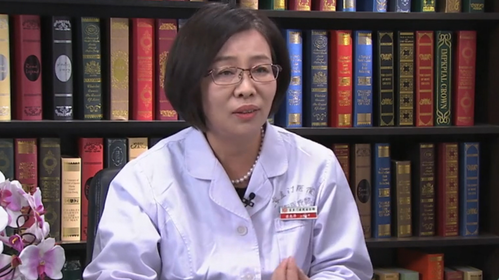

# 咳嗽//苏惠萍教授

---

## 苏惠萍 主任医师

原北京中医药大学东直门医院呼吸科主任 健康管理中心主任；

中华中医药学会健康管理分会副主任委员；中华中医药学会肺系病分会常务委员；中国中医药信息研究会膏方分会会长；国家中医药管理局重点学科中医肺病学学科带头人；北京中医药学会肺系病分会顾问

**主要成就：** 主持或参加国家级及省部级课题十余项。其中国家（973计划）“肺与大肠相表里”之神经肽联络机制的实证研究荣获2016年中华中医药学会科学技术二等奖；现主持在研国家自然基金“扶正剔邪搜络方对肺纤维化不同时相肺血管新生的调控及机制研究”1项；发表学术文章40余篇，主编或参编著作8部。

**专业特长：** 从事中医内科临床医教研工作33年。擅长肺间质纤维化、肺结节病、支气管哮喘、慢阻肺、慢性咳嗽、支气管扩张、慢性鼻咽炎等呼吸病的防治，既注重急性期中医内外同治、中西医等综合疗法的应用，更强调疾病稳定期的中医体质及肺康复调理，并擅长膏方、茶方、穴位贴等中医特色疗法在慢病防治、亚健康及中医体质调理中的应用。

---
