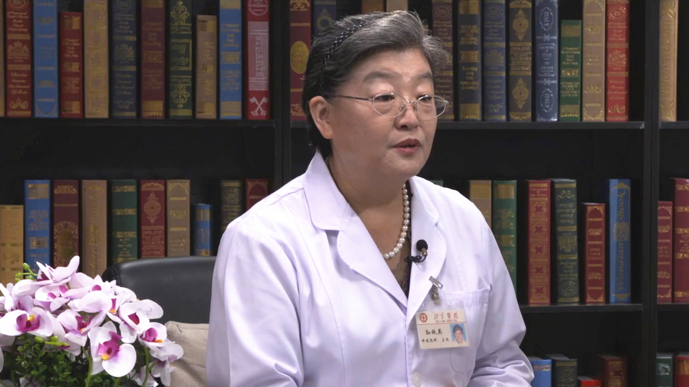

# 老年人肺部感染

---

## 孙铁英 主任医师

北京医院大内科主任 呼吸与危重症医学科原主任 博士生导师；

国家呼吸疾病临床研究中心常务副主任；国家呼吸内科专业质控中心常务副主任；中华医学会呼吸病学分会原常务委员兼秘书长；中华医学会理事；中国女医师协会呼吸分会主任委员；全国政协委员；北京医学会呼吸分会副主任委员。

**主要成就：** 获得省部级科学进步奖2项、中华医学奖2项；获得中国女医师协会五洲女子科技创新奖（终身成就奖）；发表论文200余篇。

**专业特长：** 擅长呼吸系统疑难病、呼吸系统感染、阻塞性气道病等。

---
