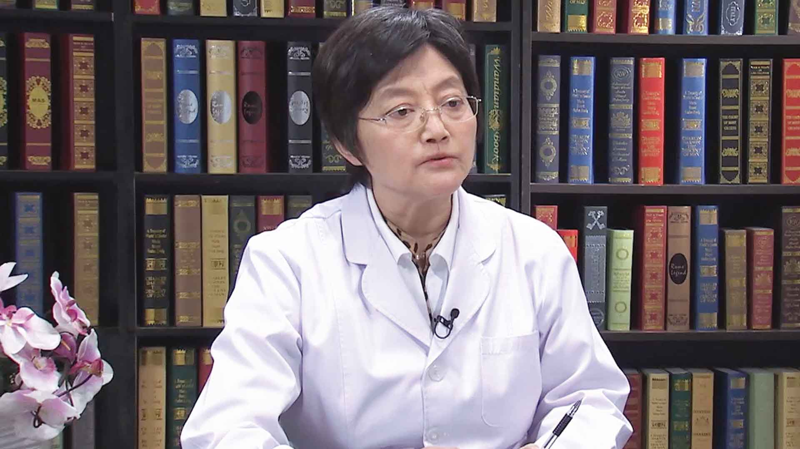

# 4.40 流感肺炎

---

## 陈旭岩 主任医师

清华大学附属北京清华长庚医院急重症部部长 急诊科主任 普内科主任 主任医师 呼吸内科学博士；

中国医师协会急诊医师分会副会长；中华医学会急诊分会感染学组副组长；中国研究型医院学会急救医学专业委员会副主任委员 ；国家卫计委全国基层医疗机构抗菌药物合理使用项目核心专家；中国医学救援协会急诊分会常务委员；中国医师协会急诊医师分会委员。

**主要成就：**国家卫计委住院医师规范化培训规划教材《急诊医学》副主编，人民卫生出版社2015.11出版；《急诊临床病案评析•感染与心血管性疾病》主编，人民卫生出版社 2016.4出版。

**专业特长：**擅长各类急危重患者的抢救和早期目标治疗，多脏器功能不全患者的救治和器官替代治疗，精通急重症感染的诊治和抗菌药物合理使用，擅长综合内科疾病的诊治和预防，疑难复杂疾病的诊断和鉴别诊断。

---
