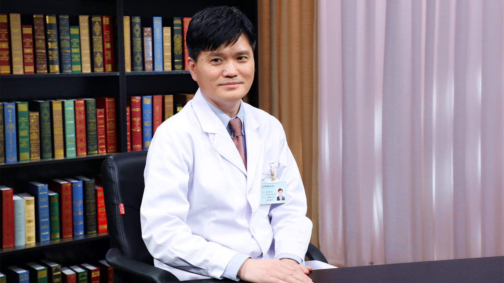

# 特发性肺动脉高压

---

## 翟振国 主任医师

中日友好医院肺栓塞与肺血管病学组学术带头人 呼吸与危重症医学科二部主任医师；

中国医师协会呼吸医师分会肺栓塞与肺血管病工作委员会主任委员；中华医学会呼吸病学分会肺栓塞与肺血管病学组副组长；中国呼吸医学教育学院肺血管疾病分委会主任；《中华老年心脑血管病杂志》编委；Clinical Respiratory Journal副主编；国际肺血管病研究院（PVRI）委员兼秘书；美国胸科医师学会（ACCP）资深委员；海峡两岸医药卫生交流协会呼吸病学专业委员会常务委员。

**学术成就：** 获得第十四届“中国优秀呼吸医师”荣誉称号，入选国家卫生健康突出贡献中青年专家；发表SCI论文70余篇，主持制定《肺血栓栓塞症诊治与预防指南》《医院内静脉血栓栓塞症防治和管理建议》；获国家科学技术进步二等奖、中华医学科技奖二等奖、北京市科学技术奖各一项；主持国家重点研发计划1项、国家自然科学基金2项、省部级项目5项。

**专业特长：** 擅长呼吸系统常见、疑难与危重症、肺血管病的诊断与治疗，尤其对肺栓塞、慢性血栓栓塞性肺动脉高压及其他肺动脉高压有系统研究；致力于肺栓塞与肺血管病的临床与转化医学研究，组织管理全国肺栓塞-深静脉血栓形成防治协作组，推广全国肺栓塞和深静脉血栓形成防治能力建设项目。

---
