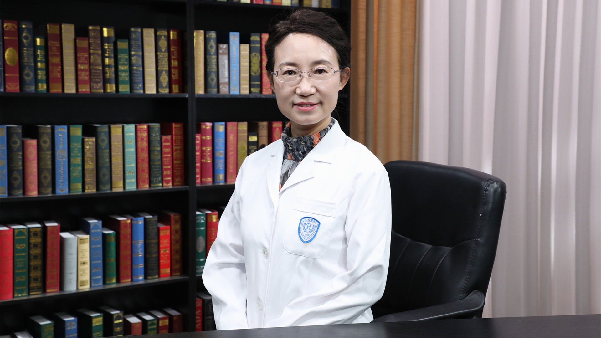

# 支气管哮喘的中西医治疗

---

## 冯淬灵 主任医师

北京大学人民医院中医科主任 主任医师 二级教授 医学博士 博士生导师；

中华中医药学会肺系病分会副秘书长；世界中医药学会联合会肺康复专业委员会副会长；中国民族医药学会热病专业委员会副会长；中国医师协会中西医结合医师分会综合医院委员会副主任委员兼秘书长；中国医师协会中西医结合医师分会呼吸病专家委员会常务委员兼副秘书长。

**主要成就：** 主持国家重点专项、国家自然基金等科研项目20余项；以第一或通讯作者在核心期刊发表学术论文70余篇，主编科普书籍3部；全国优秀中医临床人才、北京市中青年名中医、北京市重点专科学科带头人；获中华中医药学会、中国中西医结合学会科技进步奖各1项；获“敬佑生命·荣耀医者”中华医药贡献奖、“首都中医榜样人物”称号等荣誉。

**专业特长：** 擅长中西医结合防治呼吸、消化、肿瘤等多系统疾病。

---
