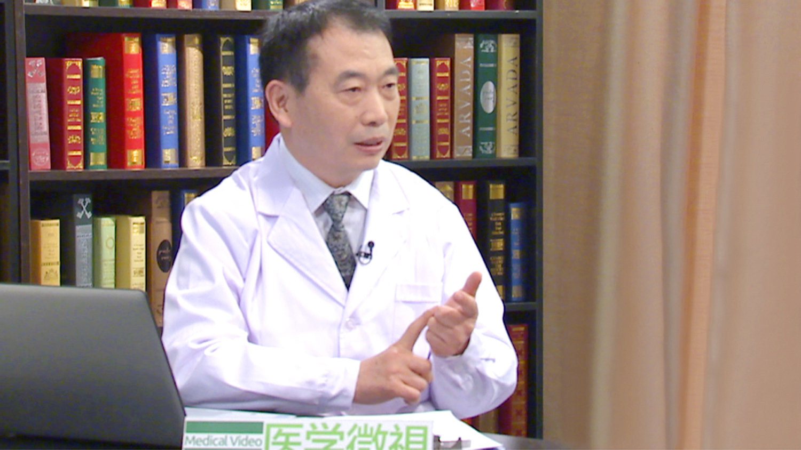

# 便秘

---

## 李恒爽 主任医师

首都医科大学附属朝阳医院西区肛肠外科主任 主任医师；

北京圣马克医院主任医师；中华中医药学会肛肠分会常务理事；中国医师协会中西医结合医师分会肛肠病学专家委员会常务理事；中国中医药高等教育学会临床教育研究会肛肠分会副秘书长兼常务理事；中国医促会肛肠学会常务理事；北京中医药学会肛肠学会常务理事；北京中西医结合学会大肠肛门病学术委员会委员；国家科技奖励评审专家；国家发改委药品价格评审中心评审专家；北京市科委生物医药专业评审委员；中国临床医生杂志编委。

**专业特长：** 从事中西结合肛肠外科临床、教学和科研工作30余年，擅长“无痛治疗肛肠病；便秘的诊断治疗；环形混合痔；结肠炎；肛门瘙痒症；不损伤括约肌的高位肛管直肠瘘疗法”等课题，并在这些疾病的治疗方面，研究了自己独特的方法、药物和器械，形成了自己“疗效高；疗程短；痛苦小；并发症后遗症少”的特点，受到国内外患者的好评。

---
