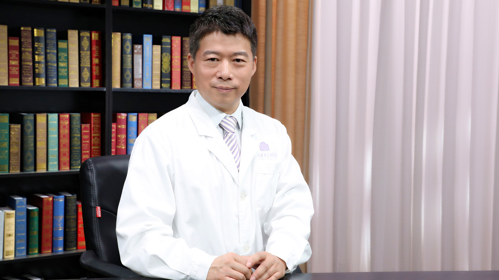

# 肠外瘘

---

## 李元新 主任医师

清华大学附属北京清华长庚医院胃肠外科主任 主任医师 教授；

中国医学促进会腔镜内镜外科学分会副主任委员；中国医师协会结直肠专业委员会肠外与肠内营养专委会副主任委员；中国医师协会外科医师分会肠瘘医师委员会常委；中国医学促进会胃肠外科学分会常务委员；中华医学会肠外肠内营养学分会全国委员；中华医学会外科学分会营养支持学组委员；北京医学会肠外肠内营养学分会常务委员。

**主要成就：** 曾执笔撰写我国第一版有关小肠移植的诊疗规范和技术“指南”，曾申请并获得科研基金700余万元；获得包括“国家科学技术进步一等奖”在内的省、部级以上的医学奖励共5项；带领团队拥有腹腔严重粘连的独特分离、肠瘘腹腔感染引流、复杂消化道重建和腹壁重建、腹腔镜精准微创手术、小肠移植高难度手术和外科营养支持等一批特色鲜明、高难度的临床技术，使团队能够解决胃肠外科领域疑难复杂的临床问题，吸引了大批全国各地复杂疑难胃肠外科病人前来就诊。

**专业特长：** 擅长腹部手术并发症和慢性放射性肠炎（放疗后肠损伤）导致的肠梗阻和肠外瘘的外科治疗，腹腔结核、克罗恩病和肠功能衰竭的外科治疗；擅长结直肠腹腔镜微创手术（包括腹腔镜结直肠肿瘤根治术和良性疾病的全结肠切除术），完全腹腔镜胃癌根治手术，小肠移植及腹腔多器官簇移植，外科营养支持。

---
