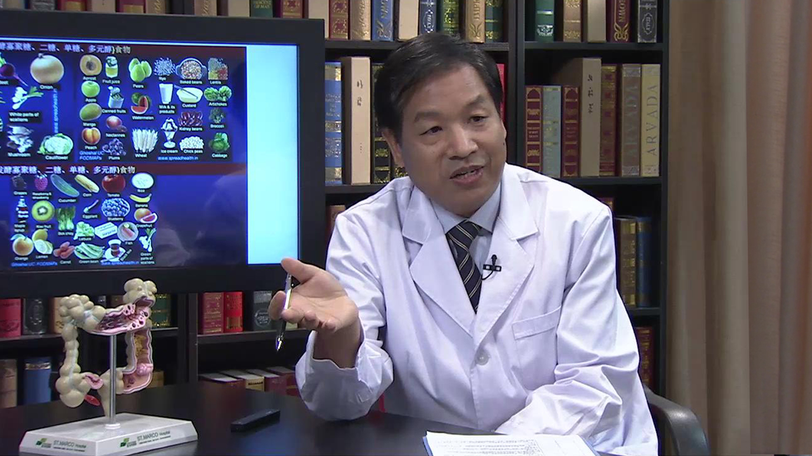

# 肠易激综合征

## 尚占民 主任医师

首都医科大学附属北京朝阳医院西院消化内科主任 主任医师 硕士研究生导师 医学博士；

中华医学会消化病学分会胃肠动力学组委员；中华医学会消化病学分会身心疾病协助组委员；北京医学会消化病学分会消化动力及心理学组委员；西部精神医学协会消化身心健康专业委员会常委；西部精神医学协会消化整合医学分会执行理事。

**主要成就：** 在国内率先开展高分辨食管压力测定及24小时食管阻抗pH测定工作；在SCI及中华系列等期刊上发表相关研究论文40多篇，参与编写专著4部，其中1部任主编，2部任副主编。

**专业特长：** 擅长胃肠动力及功能性胃肠病的诊断及治疗，消化内镜下诊断与治疗。

---
