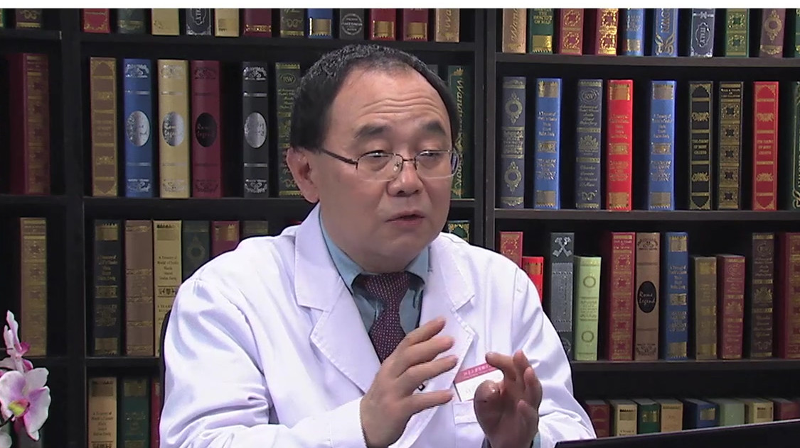

# 胆结石

---

## 刘京山 主任医师

北京大学首钢医院普外科主任 主任医师 硕士研究生导师；

中国医师协会内镜医师分会副会长；中国医师协会内镜医师分会内镜微创保胆专业委员会主任委员；中国医师协会内镜医师分会普通外科内镜与微创专业委员会主任委员；中华全科医师学会副会长；享受国务院政府特殊津贴专家。

**主要成就：** 在肝胆外科方面具有较高造诣，在胆囊疾病的治疗上更具独到之处，带领的外科研究团队在国内首创了内镜微创保胆技术，制定了我国《内镜微创保胆手术指南》（2015版），在纤维胆道镜治疗胆石症方面处于全国领先地位。

**专业特长：** 擅长胆道镜治疗肝内胆道残余结石，经皮经肝胆道镜以及术中胆道镜、十二指肠镜治疗胆总管结石、胆道肿瘤。

---
