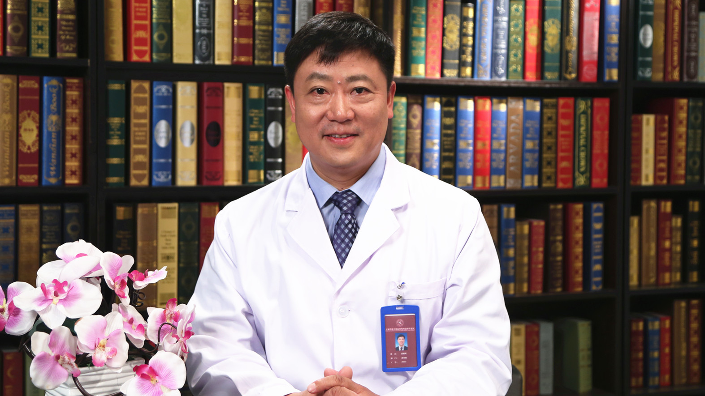

# 胆囊切除术后并发症的原因及诊疗

---

## 汤朝晖 主任医师

上海交通大学医学院附属新华医院普外科主任医师 临床医学博士；

中国医师协会外科医师分会胆道外科医师委员会副主任委员兼秘书长 青年委员会主任委员；中华医学会外科学分会脾脏及门静脉高压症学组委员；国家卫计委医管中心加速康复外科（ERAS）专家委员会委员；国际肝胆胰协会中国分会外科委员；中国研究型医院学会加速康复外科专业委员会委员兼胆道学组组长；中国研究型医院学会数字医学临床外科专业委员会常务委员；中国研究型医院学会胰腺疾病专业委员会常务委员。

**主要成就：** 发表中英文论文数十篇；执笔撰写《胆囊切除术后常见并发症的诊断与治疗专家共识》 《胆道手术加速康复外科专家共识》《胆道外科日间手术规范化流程专家共识》等国家级专家共识；主持多项国家自然科学基金，上海市科委、教委项目及多中心临床研究，获教育部自然科学奖一等奖一项。

**专业特长：** 致力于肝胆良恶性疾病的基础与临床研究，擅长肝胆良性疾病、恶性肿瘤的外科治疗、综合治疗及腹腔镜微创治疗。

---
