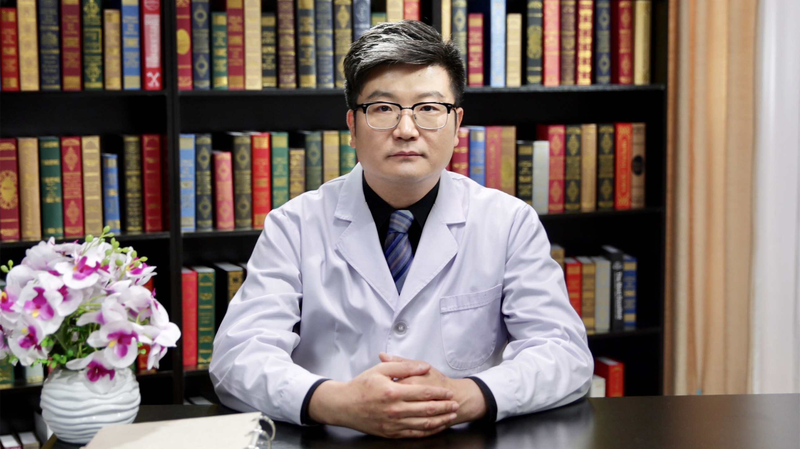

# 5.20 腹股沟疝的个体化治疗

---

## 申英末 主任医师

首都医科大学附属北京朝阳医院疝和腹壁外科副主任 首都医科大学教授 主任医师 博士 硕士研究生导师；

中国医师协会外科医师分会疝和腹壁外科医师委员会常务委员兼秘书长；全国卫生产业企业管理协会疝和腹壁外科产业及临床研究分会副会长；全国卫生产业企业管理协会疝和腹壁外科产业及临床研究分会日间手术与分级诊疗专业组组长；国际疝和腹壁外科内镜考评与标准学院副院长；世界内镜医师协会疝和腹壁外科协会秘书长；中华疝和腹壁外科在线教育学院副院长；国际内镜疝协会（IEHS）委员 中国分会委员兼会务秘书；中华消化外科菁英荟疝与腹壁外科学组委员兼秘书；中国医疗保健国际交流促进会健康科普分会疝外科健康促进学组副组长。

**主要成就：** 国内核心期刊发表论文100余篇，SCI期刊发表论文20余篇；主译国外疝外科专著4部；获得中华医学科技奖、北京市科学技术奖、华夏医学奖各1项；承担10余项各级疝和腹壁外科基金项目。

**专业特长：** 擅长疝和腹壁外科各类常见及复杂疑难疾病的诊治、各类无张力疝修补手术和微创腹腔镜疝修补手术。

---
