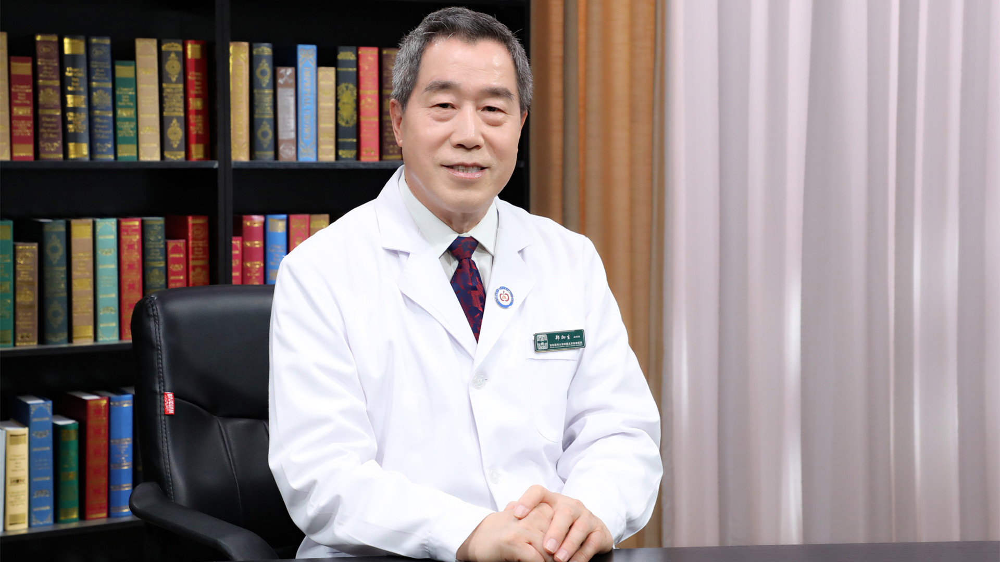

# 5.26 肝癌消融治疗

---

## 郑加生 主任医师

首都医科大学附属北京佑安医院首席专家 肝癌MDT诊疗中心主任 主任医师 教授 博士生导师；

国家肿瘤微创治疗产业技术创新战略联盟创始人 理事长；国家重点研发计划评审专家；国家卫健委《肿瘤消融治疗技术管理规范》专家组组长；中国医师协会消融专家工作指导委员会主任委员；北京医师协会介入放射学专业医师分会会长。

**主要成就：** 负责承担5项国家级课题；出版专著3部；申请专利6项；发表论文60余篇。

**专业特长：** 擅长各种肿瘤消融技术和血管及非血管性介入治疗技术，特别是早期肺癌磨玻璃结节（GGO）的诊断及微创消融治疗；擅长CT/DSA/MRI/超声引导下化疗栓塞序贯射频消融、微波消融、冷冻消融、纳米刀消融治疗肝癌、胆管癌、肺癌、肾癌、胰腺癌、肾上腺肿瘤、骨与软组织肿瘤、乳腺癌、甲状腺肿瘤、前列腺癌、前列腺肥大等良恶性肿瘤及类肿瘤性病变，获得根治性治疗效果。

---
