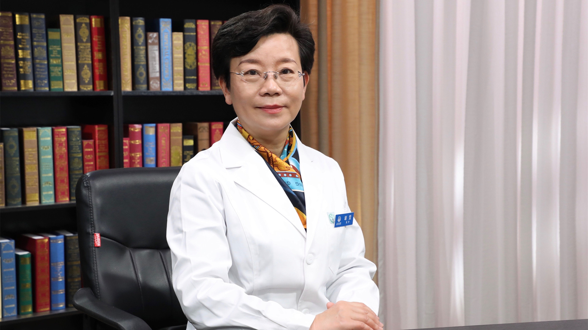

# 肝性脑病

---

## 谢雯 主任医师

首都医科大学附属北京地坛医院肝病中心副主任 主任医师 博士生导师 北京医学会肝病学分会候任主任委员；

中国防痨协会结核病与肝病专业分会副主任委员；中华医学会肝病学分会肝炎学组委员；中华医学会肝病学分会药物性肝病学组委员；国家科学技术奖励评审专家；国家发改委药品价格评审中心评审专家；国家自然科学基金评审专家。

**主要成就：** 近年来发表SCI论文20余篇，中文核心期刊论文50余篇；《肝脏》《临床肝胆病杂志》《中国医刊》《中国临床医生》等多家杂志编委 。

**专业特长：** 从事肝脏疾病诊治36年，有丰富的临床经验，擅长乙型肝炎及肝硬化、丙型肝炎及肝硬化、药物性肝损伤、脂肪性肝病等慢性疾病全流程管理及诊治，对疑难肝病诊治及危重症救治有着独到的临床救治经验。

---
