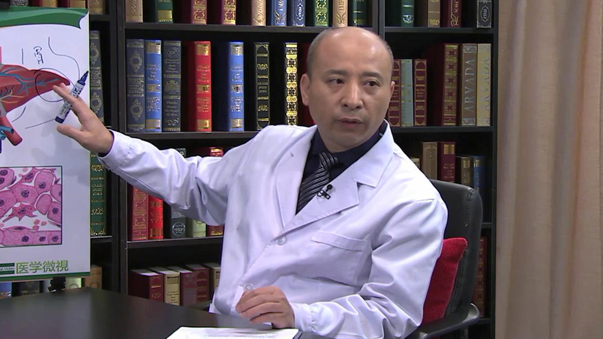

# 肝血管瘤

---

## 杨志英 主任医师

中日友好医院肝胆外科主任 主任医师 硕士研究生导师；

中国抗癌协会胰腺癌专业委员会神经内分泌肿瘤学组委员；中国医疗保健国际交流促进会胰腺病分会副主任委员；中国腹腔镜肝切除发展与推广专家委员会委员；中国研究型医院学会微创外科专业委员会委员；海峡两岸医药卫生交流协会胰腺癌学组和肝癌学组委员；中华医学会医疗损害鉴定专家；北京医学会肿瘤学分会委员；北京医学会医疗损害鉴定专家。

**主要成就：** 以第一作者及通讯作者在国内外医学杂志发表论文30余篇；SCI论文3篇；参与编写及翻译专业著作5部。

**专业特长：** 多年来工作在临床第一线，在普外科领域积累了丰富的临床经验，擅长肝、胆、胰、脾及甲状腺等普外科疾病的诊断和外科治疗。尤其擅长疑难复杂疾病的诊断治疗。

---
