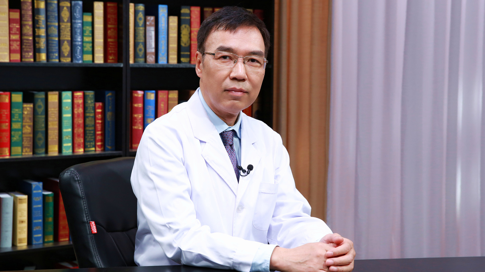

# 梗阻性黄疸

---

## 杨尹默 主任医师

北京大学第一医院院长 普外科副主任 主任医师 博士生导师；

北京大学肝癌诊疗研究中心副主任；中华医学会外科学分会胰腺学组副组长；中国研究型医院学会胰腺疾病专业委员会副主任委员；中国研究型医院学会消化道肿瘤专业委员会副主任委员；中国研究型医院学会普通外科学专业委员会常务委员；中国抗癌协会胰腺癌专业委员会委员；北京医学会外科学分会委员；北京医师学会普通外科专家委员会副主任委员；北京医学会肿瘤学分会常务委员。

**主要成就：** 2004年获北京市优秀教师称号；2004年获北京大学教学成果奖二等奖；2008年获北京市教学成果二等奖、北京大学教学成果一等奖；2009年被评为首都教育先锋教学创新个人；2010年获北京市高校“育人标兵”称号；2010年入选北京大学医学部优秀人才奖励计划。

**专业特长：** 擅长肝胆胰外科，肿瘤外科，胰腺癌及慢性胰腺炎的治疗。

---
