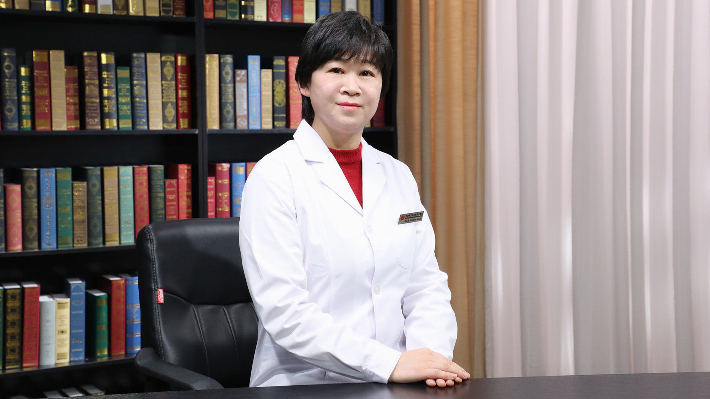

# 5.38 功能性消化不良的中西医结合护理

---

## 黄砚萍 主任护师

中国中医科学院西苑医院脾胃病所 肝病科护士长 主任护师 硕士生导师；

冯运华中医护理传承弟子；中华护理学会专家库成员；北京护理学会内科专业委员会消化学组秘书；北京护理学会中医护理专业委员会委员；中国民族医药学会科普分会常务理事 科普专家。

**主要成就：** 立足临床一线工作28年，带领团队创新3项特色服务（感动服务、陪检服务、握手交接班）和3项特色技术（砭石熨摩中药透入法、耳穴综合操作技术、引导性音乐想象技术），其中3项技术被推广到多家医院，在全国具有影响力；带领团队获得北京护理学会护理成果奖、中华护理学会创新发明奖，获批4项专利、6项著作权，其中砭石刮痧器专利和音乐著作权已成功转化；主持中国中医科学院科技创新课题1项，参与省部级课题4项，主编科普著作3部，专业著作1部；获批举办2020年、2021年国家级、北京市继续教育项目（中医护理耳穴技法培训班）；荣获“敬佑生命•荣耀医者”科普影响力奖。

**专业特长：** 擅长慢性病患者自我管理、中医特色护理技术（创新砭石熨摩中药透入法、耳穴综合操作技术、引导性音乐想象技术）。

---
