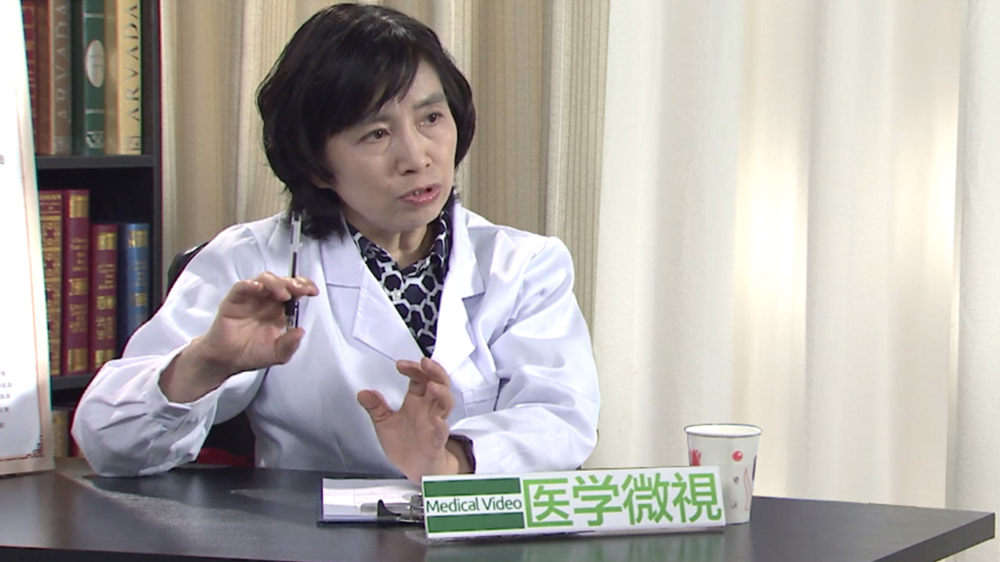

# 5.43 急性胰腺炎

---

## 唐承薇 主任医师

四川大学华西医院消化内科主任医师 教授 博士生导师；

中国医师协会消化医师分会第三届委员会副会长；中华医学会消化分会副主任委员；中华医学会消化分会消化介入协作组组长；中华医学会消化分会胰腺学组副组长；中华医学会消化分会激素学组副组长；四川省消化专委会前任主任委员；成都消化专委会主任委员；《中华消化杂志》副主编；《中华内科杂志》编委。

**主要成就：** 曾获国家杰出青年科学基金、国家自然科学基金，全国医疗卫生先进工作者；是国家突出贡献的中青年专家，四川省学术和技术带头人； 长期从事消化临床及基础研究，曾在美国、英国消化杂志、胰腺杂志、肿瘤杂志、生物技术杂志以及国内重要学术刊物如中华医学杂志、中华内科杂志、中华消化杂志、癌症等发表200多篇。

**专业特长：** 擅长从整合的角度诊治食管、胃肠、肝胆胰等消化系统常见和疑难重症疾病。

---
