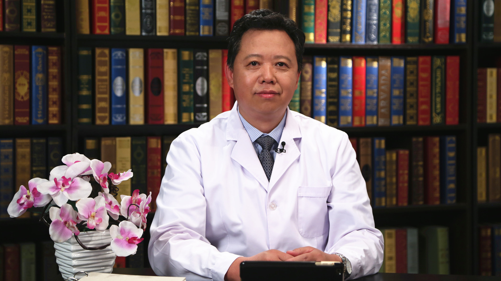

# 5.56 食管癌放射治疗

---

## 高献书 主任医师

北京大学第一医院放射治疗科主任 主任医师 教授 博士生导师；

北京大学医学部放射肿瘤学系主任；北京大学近距离治疗中心副主任；中央保健会诊专家；中华医学会放射肿瘤治疗学分会常务委员兼前列腺癌学组组长；亚洲放疗联盟（FARO）主席；中国研究型医院学会放射肿瘤学会专业委员会主任委员；中日医学科技交流协会副会长。

**主要成就：** 荣获第五届“人民名医•卓越建树”荣誉称号；在前列腺癌、膀胱癌和食管癌领域有五项原创性研究成果分别被美国国立综合癌症网络（NCCN）、欧洲泌尿外科学会（EAU）和欧洲放射肿瘤学会（ESTRO）指南引用；主编我国第一部《食管癌放射治疗指南》。

**专业特长：** 致力于肿瘤放疗、综合诊治及科研、教学工作近40年，具有丰富的临床经验和深厚的理论知识。对泌尿系肿瘤、胸部肿瘤和儿童肿瘤等的光子及质子重离子治疗有深入研究。

---
