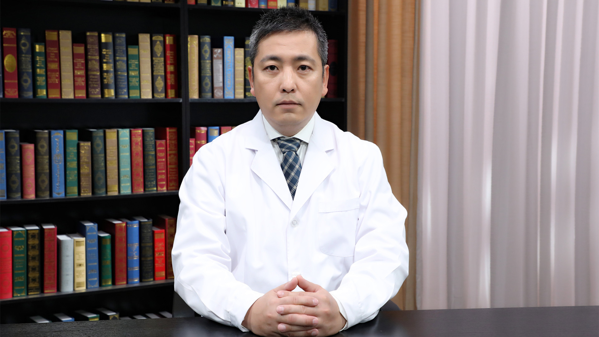

# 食管癌、胃癌的早期筛查

---

## 吴齐 主任医师

北京大学肿瘤医院内镜中心主任 主任医师；

中华医学会消化内镜学分会胃疾病协作组委员；中国抗癌协会肿瘤内镜学专业委员会全国常委；中国抗癌协会胃癌专业委员会内镜学组副组长 微创学组委员；中国医师协会外科医师分会肿瘤外科医师委员会全国常委；中国医师协会内镜医师分会全国委员 消化内镜专业委员会全国委员。

 **主要成就：** *Endoscopy International Open* 国际编委，《中国肿瘤临床》《中华胃肠内镜电子杂志》《中华消化内镜杂志》编委；IWCGO、国际胃癌学会（IGCA）、 欧洲胃肠道内窥镜学会（ESGE）、 日本消化器内视镜学会年会（JGES）会员。

 **专业特长：** 主要进行胃癌、肠癌、食管癌、肺癌、肝胆胰肿瘤的胃肠镜、气管镜、鼻咽镜、超声内镜等检查治疗；擅长胃、肠等消化道早癌的内镜下诊断及切除、晚期肿瘤内镜下介入支架置入、内镜下逆行胰胆管造影术及相关治疗、内镜下胃造瘘术、超声内镜引导支气管透壁穿刺活检。

---
