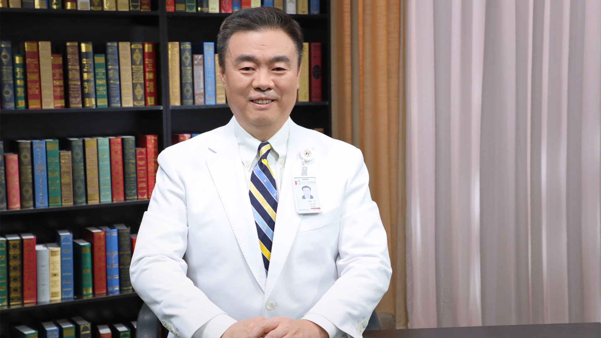

# 食管癌新辅助放化疗后的手术治疗

---

## 陈克能 主任医师

北京大学肿瘤医院胸外一科主任 主任医师 教授 博士生导师；

中国医师协会胸外科医师分会副会长；中国抗癌协会食管癌专业委员会副主任委员 青年委员会主任委员；中国抗癌协会纵隔肿瘤专业委员会副主任委员；中国抗癌协会肺癌专业委员会委员；中国抗癌协会肿瘤营养专业委员会常务委员；中国临床肿瘤学会纵隔肿瘤专家委员会副主任委员；中国临床肿瘤学会非小细胞肺癌专家委员会常务委员。

**主要成就：** 获得国家科技进步奖二等奖；承担国家自然科学基金、科技部863课题、科技部支撑计划、北京市科委重大项目等课题；发表SCI论文135篇，核心期刊论文65篇。

**专业特长：** 长期从事胸部肿瘤外科临床及科研工作，精通肺癌、食管癌、纵隔肿瘤的综合诊治、全程管理及胸外科疑难疾病诊治。

---
