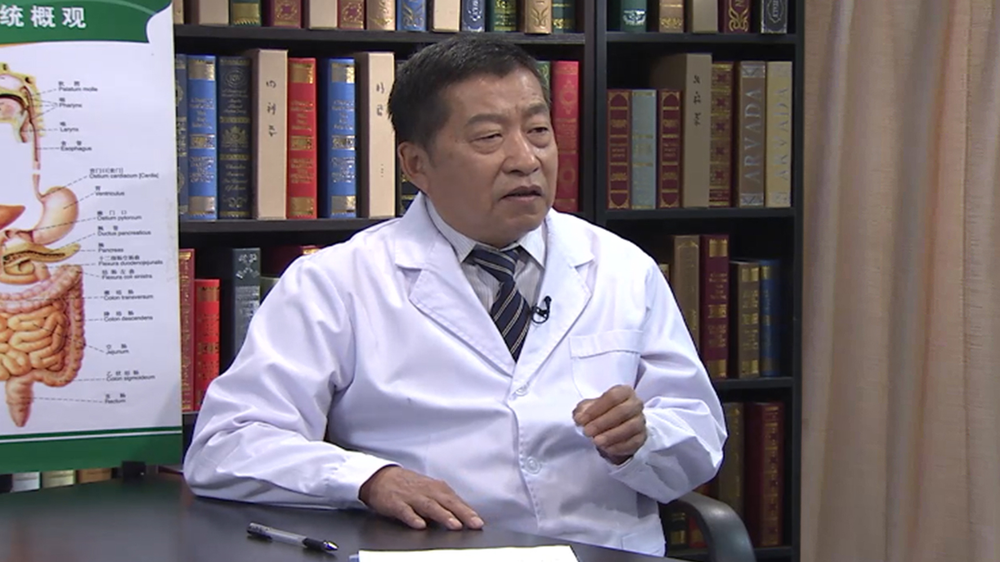

# 吞咽困难

---

## 谢鹏雁 主任医师

北京大学第一医院消化内科主任医师 博士研究生导师；

中华医学会胃肠病学分会会员；北京医学会消化病学分会常务委员；北京红十字会荣誉会员；世界胃肠病学会会员；《中华医学全科杂志》《中国医刊》《中华医学全科杂志》《中华老年病学杂志》《中国糖尿病杂志》等杂志编委。

**主要成就：** 曾主持承担并完成国家自然基金课题，卫生部、北京市自然基金课题和教育部高校博士学科专项科研基金课题多项。在国内外学医学杂志发表论文、摘要、综述和评述等医学文章180篇，参与了20本（册）医学专著和教材的编写。

**专业特长：** 长期从事内科消化学的临床工作。擅长吞咽障碍；消化不良；胃食管反流病；消化性溃疡；急慢性胰腺炎；肝硬化；肠易激综合征；炎症性肠病和其它消化系急症的诊治；在危重病人的抢救方面具有丰富的经验。

---
