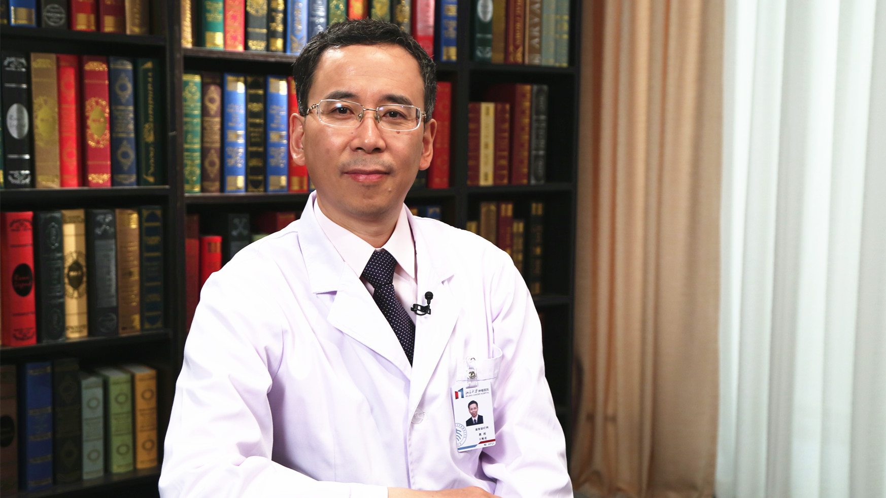

# 5.65 胃胃癌的药物治疗

---

## 王维虎 主任医师

北京大学肿瘤医院放疗科主任 主任医师 博士生导师；海峡两岸医药卫生交流学会肿瘤防治专家委员会副主任委员 ；中国抗癌协会肿瘤放射治疗学分会胃癌学组副组长 ；北京医学会肿瘤放射治疗学分会副主任委员及肝癌放疗学组组长。

**主要成就：** 发表论文100余篇，其中以第一作者或通讯作者在国外和国内核心期刊发表论文40余篇； 主持国家和省部级科研课题8项；获中华医学科技二等奖和北京市科学技术三等奖；主编《消化系统肿瘤放疗规范和靶区定义》。

**专业特长：** 致力于消化系统肿瘤放疗研究，尤其擅长各类肝癌的放疗。

---
