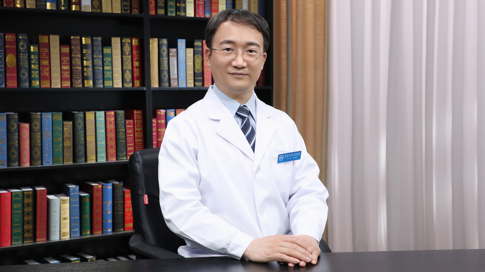

# 胃癌手术治疗

---

## 梁斌 主任医师

北京大学人民医院胃肠外科主任医师 硕士生导师 副教授 特需医疗部副主任；

中华医学会外科学分会第十八届委员会营养支持学组委员；中国医师协会外科学分会肠瘘外科医师委员会副主任委员；中国抗癌协会第一届腹膜肿瘤专业委员会委员；中国健康管理协会胃肠道肿瘤防治与管理专业委员会委员。

**主要成就：** 参与完成多项自然科学基金项目，作为第四完成人完成的“胃肠道恶性肿瘤细胞内信号传导通路异常的作用机制”通过教育部科技成果鉴定；参与多项国内、国际多中心新药注册研究；发表SCI及国内核心期刊论文70余篇；参编《外科与普通外科诊疗常规》《普通外科围手术期液体治疗》《外科疑难病例精粹》《家庭肠外营养》等多部专著；参与《克氏外科学》第15版和第18版、《结肠与直肠外科学》第4版、《循证医学》《直肠癌诊断、治疗与康复新进展》等多部译著的编译工作。

**专业特长：** 擅长胃肠道肿瘤规范化手术、腹腔镜微创手术、减重与代谢手术、晚期肿瘤姑息手术、临床营养支持治疗。

---
