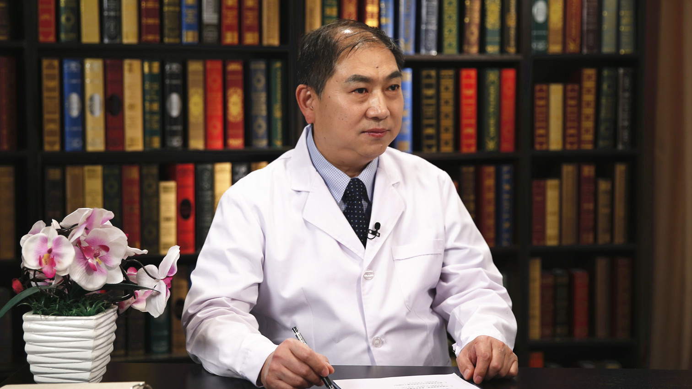

# 消化系统癌症的早期筛查

---

## 冀明 主任医师

首都医科大学附属北京友谊医院消化内科副主任 内镜中心主任 主任医师；

中华医学会消化内镜学分会常委 秘书长；中华医学会消化内镜学分会结直肠疾病学组组长；中国医师协会消化医师分会常委；北京市消化内镜学会副主委。

**主要成就：** 发表多篇论文；《磁共振胰胆管造影与内镜逆行胰胆管造影术诊断胰胆系统疾病的价值》首都医科大学学报；《腹腔镜联合内镜治疗胆囊胆总管结石疗效观察 》中国现代医药杂志等。

**专业特长：** 擅长消化内镜介入（微创）诊断与治疗，如早期癌的内镜下切除、晚期癌的支架置入、肝硬化出血的结扎和硬化、溃疡病出血的内镜下止血、胆结石的内镜下取石、胰腺炎的内镜治疗。

---
