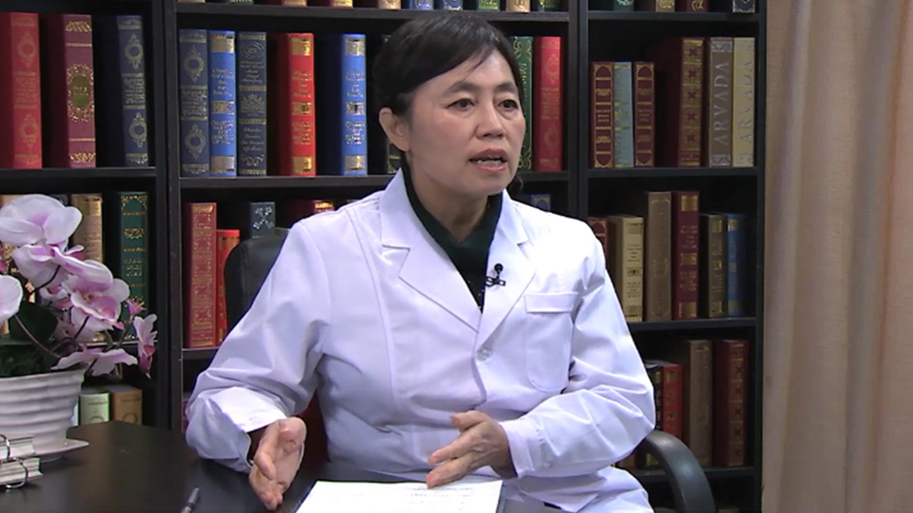

# 药物性肝病

---

## 邢卉春 主任医师

首都医科大学附属北京地坛医院肝病三科主任 主任医师；

首都医科大学传染病学系委员；中华医学会肝病学分会委员；中华预防医学会感染性疾病防控分会委员；中国中西医结合学会肝病专业委员会常委；中国医疗保健国际交流促进会肝胆疾病分会常委；亚太医学生物免疫学会肝病分会副主任委员。

**主要成就：** 曾参加北京市自然科学基金、国家重点基础研究项目（973项目）等项目的研究； 负责完成中国博士后基金、浙江省博士后择优资助、首都医学科学发展基金、北京中医药科技项目等多项目的研究；作为子课题负责人承担十二五、十三五国家科技重大专项、国家自然科学基金、首医协同创、北京医管局扬帆计划、医管局消化协同项目等项目；近年来在《Journal of Gastroenterology and Hepatology》《The Japanese Journal of Infectious Diseases》等国际、国内著名杂志、会议上发表文章70余篇。

**专业特长：** 主要研究方向为病毒性肝炎发病机理及临床诊治、肝病肠道微生态；擅长病毒性肝炎及相关肝病、肝硬化等疾病的诊治。

---
