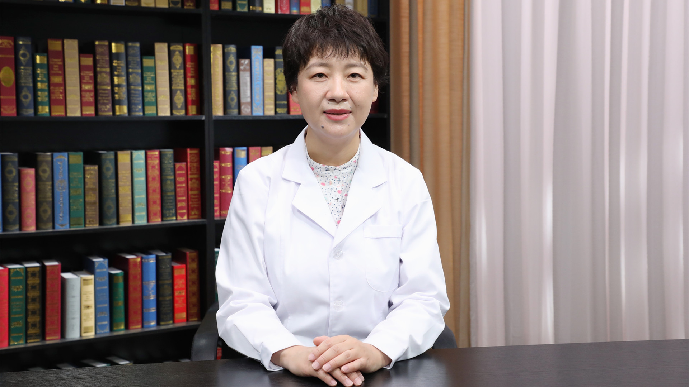

# 婴儿胆汁淤积性肝病

---

## 钟雪梅 主任医师

首都儿科研究所附属儿童医院消化内科主任 主任医师 副教授 研究生导师；

中华医学会肝病学分会遗传代谢性肝病协作组委员；中国医师协会儿科医师分会委员；中国妇幼保健协会小儿消化微创学组副主任委员；国际肝胆胰协会中国分会儿科专业委员会常务委员；北京医学会儿科学分会消化学组委员；北京医学会肠外肠内营养学分会委员。

**主要成就：** 发表学术论文数十篇，参编专著6部；承担北京市医院管理局消化内科学科协同发展中心重点项目的科研工作。

**专业特长：** 擅长儿童胃肠疾病、肝病的诊治及儿童消化内镜操作；在儿童疑难少见消化系统疾病的诊治方面有丰富经验，如炎症性肠病、慢性腹泻、食物过敏性消化道疾病、慢性腹痛、幽门螺旋杆菌感染、消化性溃疡、消化道出血、周期性呕吐综合征、儿童肝病、胆汁淤积性肝病、乳糜泻等。熟练操作儿童胃肠镜以及内镜下治疗，如息肉切除、放置钛夹止血、放置空肠营养管等。

---
