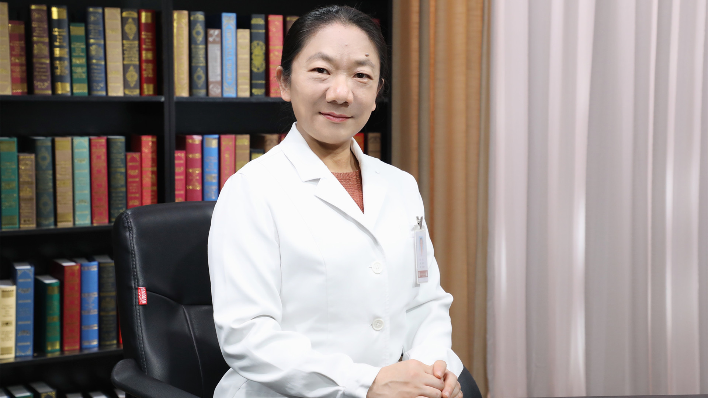

# 幽门螺杆菌的检测及治疗

---

## 成虹 主任医师

北京大学第一医院消化内科主任医师 研究生导师；

中华医学会消化病学分会第七 八届幽门螺杆菌学组秘书；中华医学会消化病学分会第九 十届幽门螺杆菌学组副组长；中国医师协会中西医结合医师分会消化病学专家委员会常务委员；中国中医药研究促进会消化整合医学执行理事；中国医药生物技术协会慢病管理分会委员会常务委员；北京医学会肠道微生态与幽门螺杆菌分会常务委员；幽门螺杆菌感染与胃癌防控办公室常务理事。

**主要成就：** 主要从事幽门螺杆菌感染检测、治疗、耐药相关方面的研究；主持或参加多项基金课题，已发表相关文章80余篇；曾参加第2-5次中国幽门螺杆菌感染处理共识的制订，并负责第4、5次共识检测部分主要内容的撰写。

**专业特长：** 长期从事消化内科疾病诊疗及内镜诊疗，擅长幽门螺杆菌相关临床疾病的诊治，尤其难治性幽门螺杆菌感染相关疾病的诊治。

---
