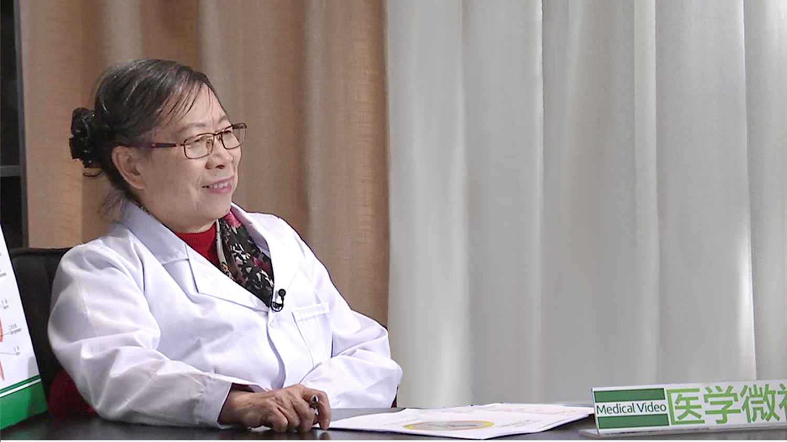

# 幽门螺杆菌感染

---

## 胡伏莲 主任医师

北京大学第一医院消化内科教授；

历任中华医学会消化分会常委；幽门螺杆菌学组组长；北京消化分会副主委；《全国幽门螺杆菌临床论坛》主席。

****主要成就：**** 共发表论文及述评230余篇；《幽门螺杆菌感染的基础与临床》；《中华名医谈百病》；《临床思维指南-消化系统疾病典型病例分析》；《幽门螺杆菌感染诊疗指南》等。致力于幽门螺杆菌与上胃肠道疾病研究。是我国幽门螺杆菌研究领域创始人之一及学术带头人和资深专家；有关研究多次获卫生部科技进步奖和北京市科技进步奖，因论文被引率髙而获中华医学杂志创刊90周年金筆奖。

---
