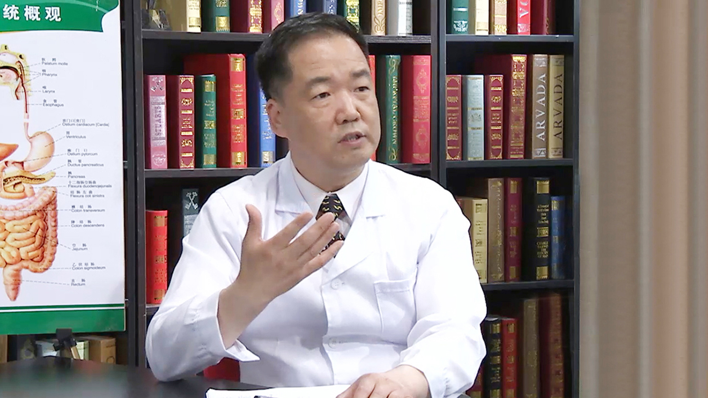

# 直肠炎

---

## 范学顺 主任医师

中日友好医院肛肠科党支部书记 主任医师 教授 医学硕士 全国肛肠知名专家 ；国家卫生健康技术推广专家库专家；全国卫生健康技术推广传承应用项目肛肠专业委员会主任委员；中国老年保健协会肛肠专业委员会会长；全国第四批名老中医肛肠专业优秀学术继承人；中华中医药学会肛肠专业委员会常务委员；中国医师协会中西医结合医师分会常务委员；中国中医药研究促进会肛肠分会副会长。
 **主要成就：** 荣获“国家第七批优秀援疆干部人才”称号，并记二等功；曾参与“芍倍注射液注射治疗痔疮的临床疗效观察”（国家二类新药）等科研工作，并于2004年获中华中医药学会颁发的部级科技二等奖励，2006年获中华医学科技奖三等奖；主编《肛肠常见疾病100讲》《实用外科诊疗思维》，担任《安氏肛肠病疗法论文集》副主编，参编《肛肠病学》《肛肠诊疗图谱》《肛肠疾病问答》《中医问诊大全》等书；在核心刊物上发表学术论文30余篇，多次在《健康报》《中国政协报》等发表科普文章，被《中国科技成果》杂志称为“痔疮终结者”。
 **专业特长：** 应用微创理念治疗各种肛肠疾病，如肛裂、肛窦炎、肛乳头瘤、高位肛瘘、肛周脓肿、肛门直肠狭窄、直肠脱垂、肛门顽固性瘙痒、肛周湿疹、肛门直肠痛、肛门神经官能症、结直肠息肉，尤其对于痔（环状痔、嵌顿痔）及复杂性肛瘘（高位、低位）有丰富的治疗经验；擅于应用非挂线方法治疗高位复杂性肛瘘、脓肿；擅于运用中医药治疗习惯性便秘、结肠炎、家族性息肉病等疾病，并且疗效满意。

---
