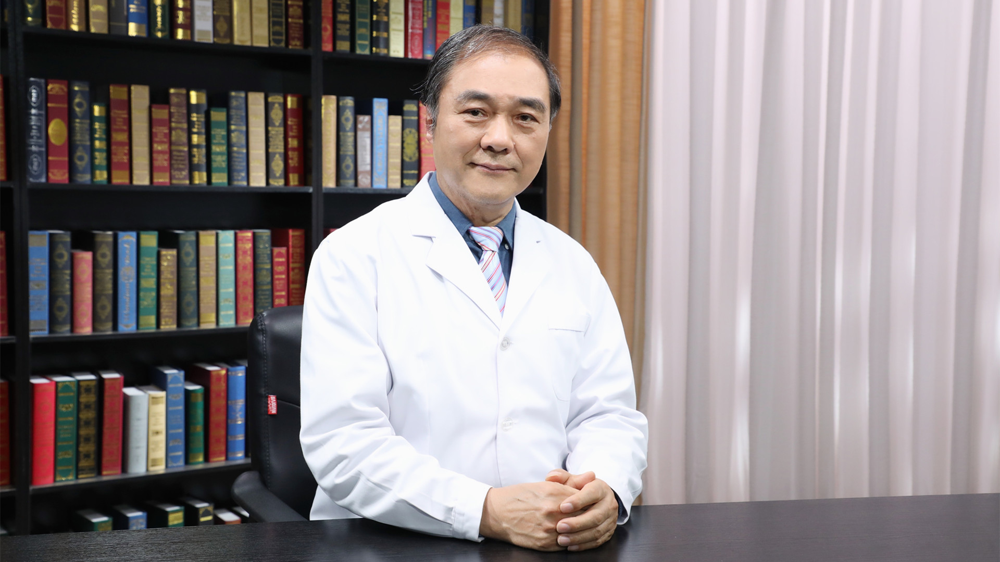

# 5.110 中西医结合治疗顽固性便秘

---

## 姚树坤 主任医师

中日友好医院原副院长 主任医师 二级教授 博士生导师；

北京中医药大学岐黄学院执行院长；中华中医药学会内科肝胆病专业委员会副主任委员；中国中西医结合学会副会长；中国中西医结合学会养生学专业委员会主任委员；中国中西医结合学会学术工作委员会主任委员；中国医师协会消化医师分会原副会长。

**主要成就：** 以第一或通讯作者发表学术论文300余篇，其中SCI论文30余篇，主编或参编著作10部；主持国家科技支撑计划、重点专项、重大研发计划项目、国家自然科学基金面上项目等10余项，获得省部级科技进步一等奖1项、二等奖3项、三等奖6项，享受国务院特殊津贴。

**专业特长：** 擅长中西医结合诊治功能性胃肠病和慢性肝病，包括顽固性便秘、胃食管反流病、肠易激综合征、顽固性嗳气，脂肪性肝病、代谢性肝病、自身免疫性肝病、药物性肝病、肝纤维化、肝硬化及其并发症、原发性肝癌等。

---
