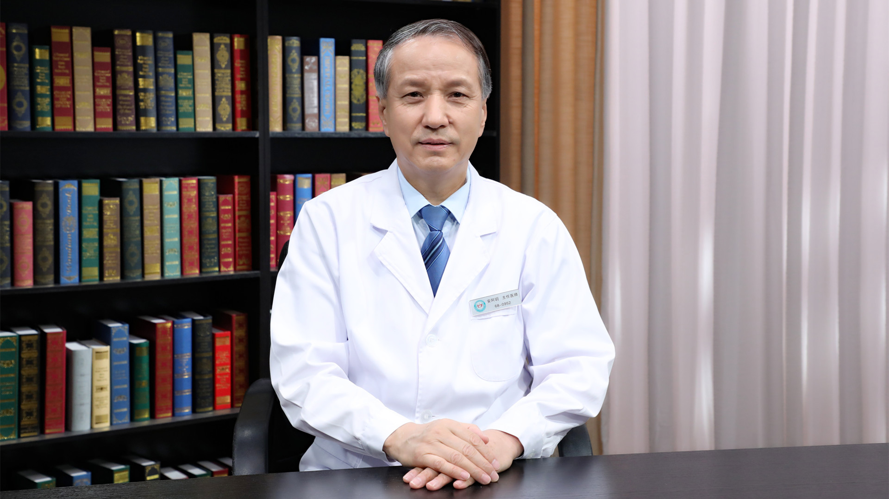

# 中医治疗便血

---

## 安阿玥 主任医师

中国中医科学院望京医院肛肠科 肛肠病安氏疗法中心主任 主任医师 教授 博士生导师；

享受国务院政府特殊津贴；中国中医科学院首席研究员 ；中华预防医学会肛肠病预防与控制专业委员会主任委员；中国医师协会肛肠专业委员会主任委员；全国医师定期考核肛肠专业编辑委员会主任委员；京津冀协同发展项目肛肠方向负责人；《中国肛肠病杂志》常务编委 《中国临床医生》特邀编委。

**主要成就：** 1991年获第四十届布鲁塞尔世界发明博览会“社会事务部奖”、个人研究最高奖“军官勋章”、项目“金牌奖”三项大奖，这是我国历届医学参展中获奖最高的一次，本人也被聘为该届医学专家组评委，并载入第四十届尤里卡名人录，被媒体称为“克痔圣手” “安一刀”；2004年获中华中医药学会科学技术二等奖，2006年获中华医学会科技三等奖，2015年获望京医院“突出贡献奖”，2017年获得中央人民广播电台“大国名医奖”，2021年4月被评为首都名中医；主编《肛肠病学》《肛肠病诊疗图谱》《实用肛肠病学》、安氏疗法系列丛书等10余部专著；发表专业论文60余篇。

**专业特长：** 致力于肛肠专业学术研究和临床工作40余年，在肛肠内科和肛肠外科均有较高的学术造诣；发明国家二类痔疮新药“芍倍注射液”；创立的肛肠病“安氏疗法”被列为国家级继续医学教育项目。

---
