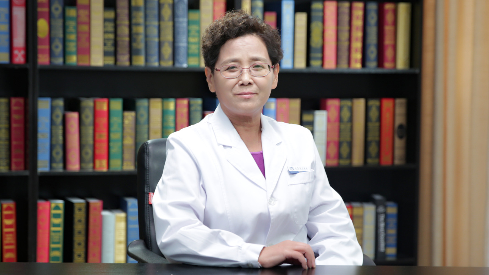

# 6.6 动脉导管未闭

---

## 金梅 主任医师

首都医科大学附属北京安贞医院小儿心脏中心副主任兼小儿心内科主任 主任医师 硕士研究生导师；

中国医师协会儿科分会先天性心脏病专家委员会副主任委员；中国医师协会心血管内科分会先天性心脏病工作委员会常委；中华医学会心血管分会结构性心脏病学组成员。

**主要成就：** 2002年到美国芝加哥大学儿童医院进修小儿心血管专业，学习归来积极开展新技术，在国内率先应用心腔内超声指导先天性心脏病介入治疗；2009年成功完成了北京市第一例复杂先天性心脏病-室间隔完整的肺动脉闭锁小婴儿的射频打孔+球囊扩张的介入治疗手术；2011年获得第六届宋庆龄儿科医学奖。

**专业特长：** 从事小儿心血管专业34年，擅长对胎儿期先天性心脏病早期发现、早期诊断、早期干预的研究，对先天性心脏病介入治疗以及肺动脉高压也有深入研究。特别是在复杂先天性心脏病的诊断及先天性心脏病的介入治疗等方面处于国内领先地位。

---
