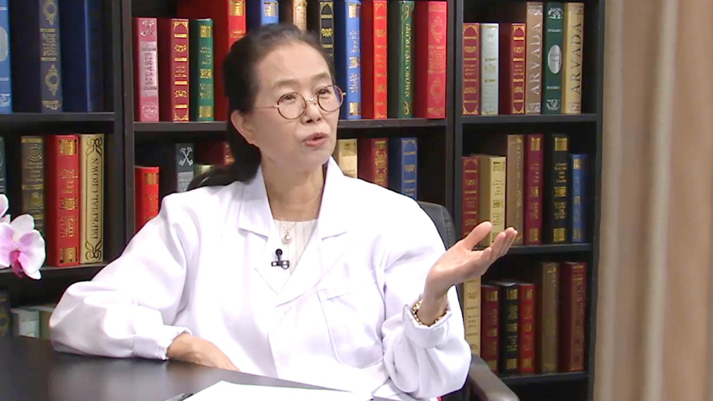

# 高血压//孙宁玲教授

---

## 孙宁玲 主任医师

北京大学人民医院高血压研究室主任 主任医师 博士生导师；

中华医学会老年学分会心血管学组副主委；中华医学会心血管学会高血压学组委员；中国医师协会高血压专家委员会副主任委员；中国女医师协会心脏血管分会副主任委员；北京医师协会高血压专业委员会主任委员；中国高血压联盟副主席、常务理事；北京高血压协会副会长；中华老年心脑血管病杂志副主编；中华高血压杂志副主编；中华心血管病杂志、中国循环杂志、中国心血管病杂志等杂志的编委或常务编委。

**专业特长：** 擅长高血压患者的动态血压监测；高血压发生脑卒中机制的研究；高血压患者血管调节肽的测定；高血压患者遗传特性的研究及高血压导致心、脑、肾损害的诊断及治疗等。

---
