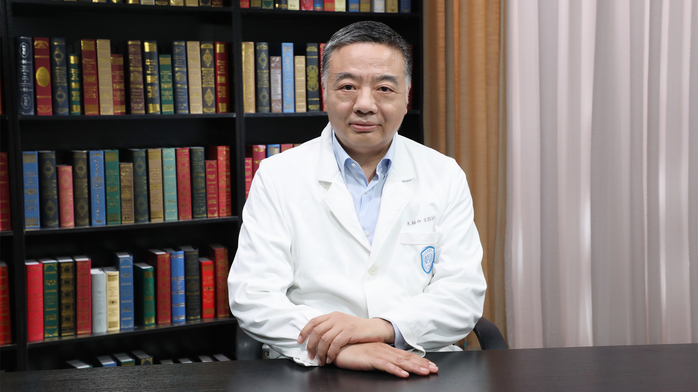

# 高血压//朱继红教授

---

## 朱继红 主任医师

北京大学人民医院急诊科主任 主任医师 硕士生导师；

北京大学医学部急诊医学学系主任；北京医学会急诊医学分会副主任委员；北京整合医学学会血栓与止血分会副主任委员；北京中西医结合学会急诊分会副主任委员；北京中医药学会急诊专业委员会副主任委员；北京急诊医学学会副会长；北京医师协会急诊医师分会副会长；中国急诊急救专科联盟副会长。

**主要成就：** 《中国急救医学期刊》《中华急诊医学杂志》《疑难病杂志》《中国医药杂志》《中国急救灾害与复苏医学杂志》编委；《中华医学杂志》中文版、英文版审稿专家。

**专业擅长：** 主要从事心脑血管急症研究，建立了急性心衰单元，急性肺栓塞综合诊疗体系，急诊出凝血疾病的诊疗。

---
