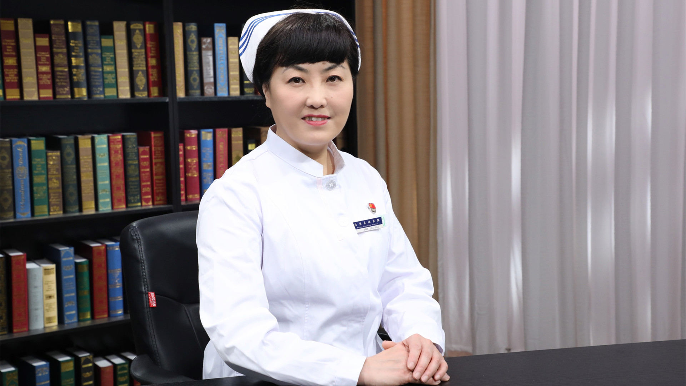

# 高血压的护理

---

## 赵立新 主任护师

首都医科大学附属北京友谊医院护理部副主任 心血管中心科护士长；

首都医科大学心血管护理学系副主任委员；中华护理学会第27届理事会心血管护理专业委员会副主任委员；北京护理学会第十一届心血管病专业委员会委员；全国呼吸与危重症专科护理联盟第一届理事会理事。

**主要成就：** 发表核心期刊论文10余篇；曾获“首都医科大学校长基金”；参与多项国自然与北自然研究，并主持局级课题1项。

**专业特长：** 擅长心血管专业相关疾病的临床护理、护理教学、护理质量控制管理及改善、心血管慢病管理、心脏康复、老年护理等方向；对心血管专科护士的培养、心血管慢病管理、心脏康复有深入研究。

---
