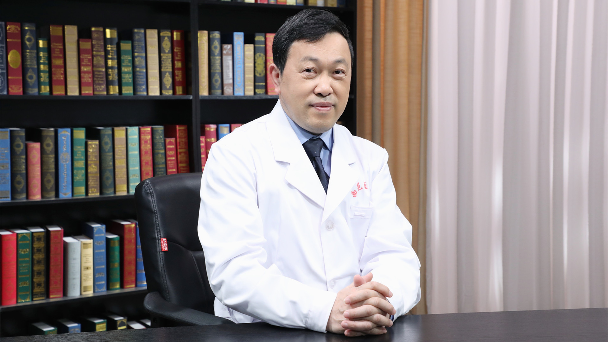

# 高血压的中医治疗

---

## 衷敬柏 主任医师

中国中医科学院西苑医院心血管科主任医师 临床医学博士 博士生导师 学科建设办公室主任；

中华中医药学会心血管病分会常务委员；中华中医药学会膏方分会常务委员；北京中医药学会养生康复专业委员会主任委员；北京市社区卫生协会中医分会主任委员。

**主要成就** ：以第一作者或通讯作者在《中医杂志》《中华中医药杂志》等国内中文核心期刊发表论文60余篇；参与2项国家重点基础研究发展计划（973计划）研究项目，主持北京市科学技术委员会、北京市中医管理局及中国中医科学院等课题；获国家科学技术进步二等奖1项、中华中医药学会、中国中西医结合学会、北京市等科技奖等。

**专业擅长** ：专长高血压、高血压肾病，冠状动脉支架术后中医药康复，心力衰竭、疲劳综合征治疗；擅长中药、非药物疗法及膏方治疗心血管疾病。

---
