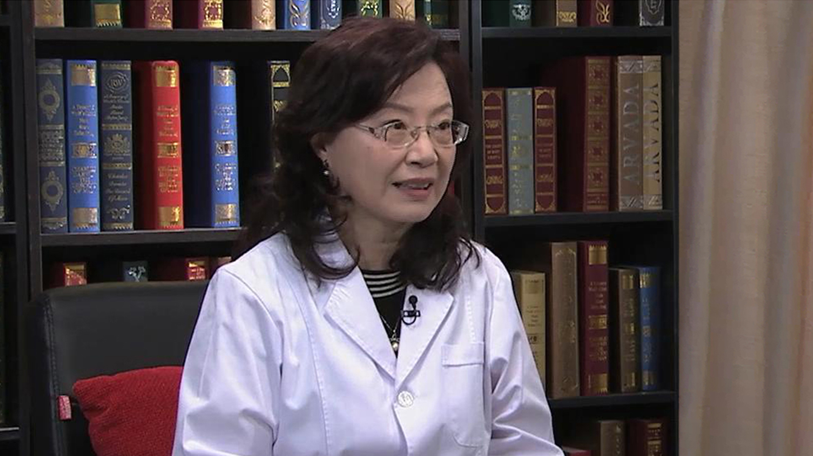

# 6.20 高脂血症

---

## 陈红 主任医师

北京大学人民医院心脏中心主任 心内科主任 主任医师 博士生导师；

中华医学会北京分会内科专业会候任主任委员 ；中国医师协会心血管内科医师分会动脉粥样硬化专业委员会副主任委员；享受国务院政府特殊津贴专家和国家卫计委有突出贡献中青年专家；国家心血管病专家委员会第一届委员会委员。

**主要成就；** 发表论文100余篇，包括在心血管领域有影响力的国际期刊发表多篇论著 ；近年主持和参与国家科技支撑计划、国家自然科学基金、北京市科技计划重大项目等课题10余项 ；获得中华医学科技奖、中华预防医学科技奖、北京市科学技术奖等科研奖励7项。

**专业特长：** 对常见及疑难危重心血管疾病的诊治具有丰富的临床经验，尤其擅长高脂血症、冠心病、高血压及心力衰竭的诊疗。在中国人群的调脂治疗、动脉粥样硬化的发病机制、急性冠脉综合征早期预警和规范化救治等方面取得一系列成果。

---
