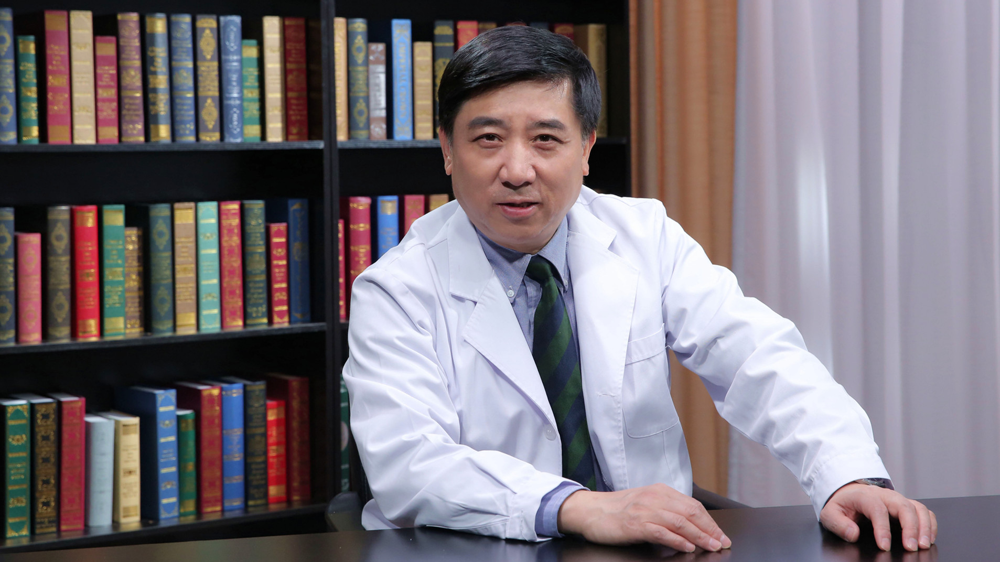

# 急性冠状动脉综合征的介入治疗//颜红兵教授

---

## 颜红兵 主任医师

中国医学科学院阜外医院冠心病中心副主任 主任医师 医学博士 博士生导师；

美国心脏病学院会员（FACC）；欧洲心脏病学会会员（FESC） ；中国医师协会胸痛专业委员会副主任委员。

**主要成就：** 《中国介入心脏病学杂志》副主编，《中华心血管病杂志》等杂志编委，《International Journal of Cardiology》和《中华医学杂志》等杂志审稿专家；先后承担过10余项国家和北京市重大项目和自然科学基金项目；发表文章300篇，专（译）著50部。

**专业特长：** 擅长急性冠状动脉综合征的临床与基础研究，冠状动脉介入治疗。

---
