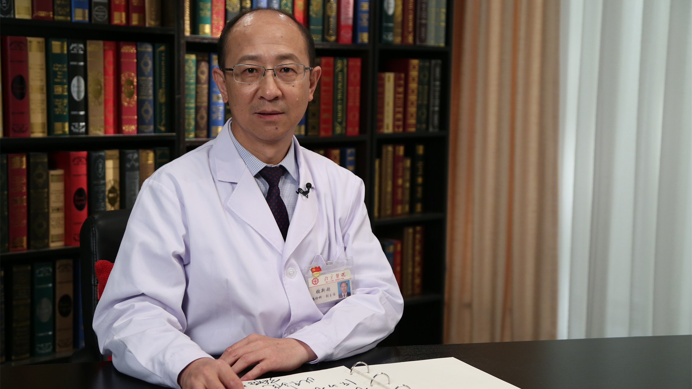

# 急性冠状动脉综合征的介入治疗//张新超教授

---

## 张新超 主任医师

北京医院国家老年医学中心急诊科主任 主任医师 研究生导师；

中央保健会诊专家；中华医学会急诊医学分会委员；中国医师协会急诊医师分会常务委员兼副总干事；中国医促会理事暨急诊急救分会副主任委员；北京医学会急诊医学分会副主任委员。

**主要成就：** 参编教材与专业著作近20部；发表学术论文80余篇；参与和主持省部级科研课题多项；2003年获“首都防治非典工作先进个人”；2012年获“北京医学会先进个人”；2015年第二届中央人民广播电台“京城好医生”评选获“金牌好医生”；2015年评选为国家卫健委直属机关党委“优秀党务工作者”。

**专业特长：** 从事急诊与危重病医学、心血管内科学专业以及干部医疗保健，同时参与老年病学相关的临床与基础研究，擅长心血管急重症临床诊治等。

---
