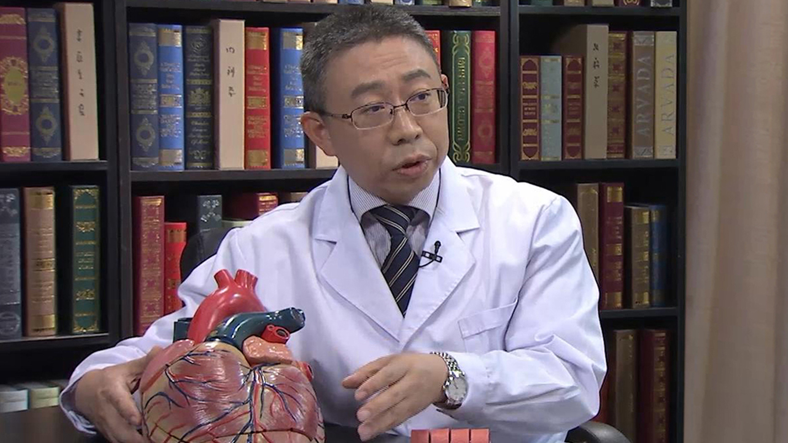

# 急性冠状动脉综合征

---

## 陈牧雷 主任医师

首都医科大学附属朝阳医院冠心病监护室主任 心内科副主任 内科教研室副主任 主任医师；

中华医学会心血管病分会心力衰竭专业组委员,中华检验协会心血管病专业委员会委员，中国康复医学会心血管专业委员会委员,北京医学会内科学分会委员兼秘书，北京高血压防止协会理事，北京市住院医师规范化培训内科专业委员会委员，北京市朝阳区医学损害鉴定专家。

**主要成就：** 曾获北京市科技进步二等奖；发表专业论文20余篇，参编专著6部。

**专业特长：** 主要从事心脏危急重症患者的诊断、监护与救治，在心脏重症监护室累计工作达4年以上，熟悉心脏内科常见危急重症的抢救流程，能合理应用各种监护、治疗设施，使危急重症的抢救成功率达到国内先进水平。

---
