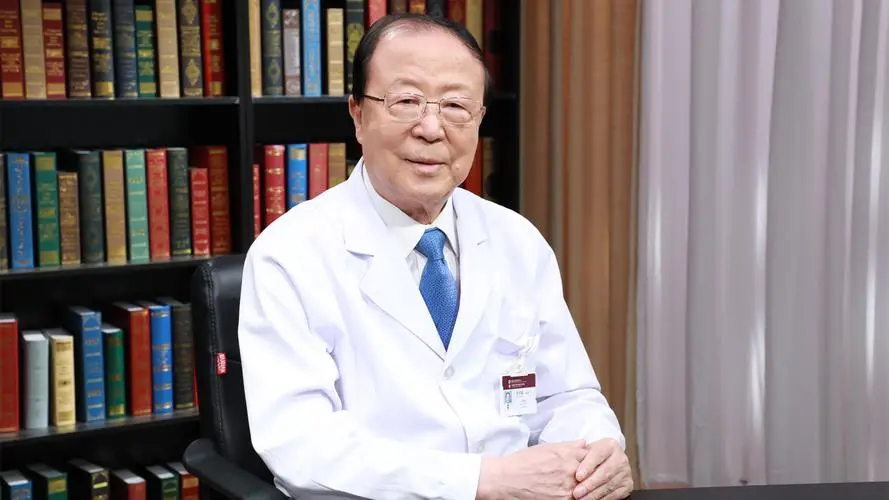

# 急性心肌梗死

---

## 高润霖 院士

曾任中国医学科学院阜外医院院长 心血管病研究所所长 心内科主任；

现任中国医学科学院阜外医院资深顾问专家 研究员 博士生导师；国家心血管病中心专家委员会主任委员；中华医学会常务理事；北京医师协会名誉会长；任第九 十 十一届全国政协委员。

**主要成就：** 我国介入心脏病学先驱者之一，对我国介入心脏病学发展做出贡献；先后获得国家科技进步二等奖3项，北京市科技进步二等奖3项，中华医学科技奖二等奖2项，卫生部科技进步三等奖2项；发表论文500余篇，主编和参编专著10部；培养博士生16名，硕士生4名，博士后2名；近年来关注心血管病人群防治研究与实践，主持 “十二五”国家科技支撑项目“中国重要心血管病患病率调查及关键技术研究”。

**专业特长：** 擅长冠心病介入治疗，在国内首先开展急性心肌梗死及并发心源性休克的急诊介入治疗，使病死率明显降低，达到国际先进水平。

---
