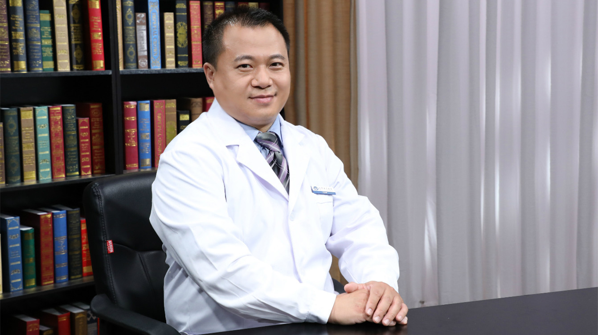

# 6.35 扩张型心肌病的超声诊断

---

## 张纯 主任医师

首都医科大学附属北京安贞医院超声三部主任 主任医师 硕士研究生导师；

中国医师协会超声医师分会心脏超声专业委员会副主任委员；中国超声医学工程学会超声治疗及生物效应专业委员会常务委员；中国研究型医院学会心血管影像专业委员会常务委员；中国研究型医院学会心脏瓣膜病专业委员会常务委员；北京医学会超声医学分会第九届委员会委员。

**主要成就：** 近年来发表SCI及核心期刊论文30余篇，参编著作7部；主持及承担多项课题，包括国家自然基金、北京市科技计划课题、首医基础临床科研合作基金重点项目等；在国内首先牵头开展人工智能瓣膜并发症的超声筛查科研专项工作；自主研发心脏术中食道探头咬合器，已申请专利。

**专业特长：** 擅长各种复杂先天性心脏病、心脏瓣膜病、人工瓣膜置换术后瓣周漏的诊断；在超声引导心脏介入手术中有很深的造诣，率领超声团队配合心脏内、外科圆满完成了各种复杂先心病、换瓣后瓣周漏封堵、TAVI、Mitral Clamp、TTVI、PPVI、瓣中瓣等心脏介入手术，在国内、国际处于领先水平。

---
